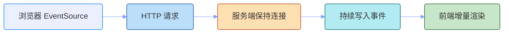
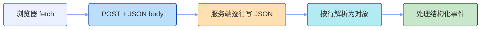
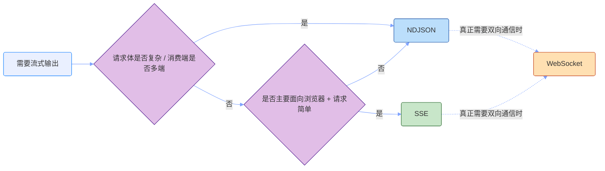

# SSE 和 NDJSON 指南

做 AI 应用时，很容易遇到一个体验问题：模型可能要十几秒才生成完整答案。如果后端等所有内容都准备好再一次性返回，用户看到的就是一段长时间空白。

所以很多问答、Agent、日志和任务进度页面都会使用“流式输出”：服务端一边产生结果，一边把增量内容推给前端。AI 应用里常见的两种方案是 SSE 和 NDJSON。它们通常都依赖 HTTP 分块传输，本质上都是服务端持续往一个长响应里写数据，区别主要在数据格式和事件语义。

它们都能让前端“边收到边渲染”，但请求方式、数据格式和适用场景不一样。

## 为什么需要流式通信

流式通信解决的是“服务端持续把状态变化推给消费端”的问题。没有流式通信时，前端通常有两种选择：

第一种是普通 HTTP：请求发出去，等服务端处理完，再拿到完整响应。这种方式简单，但不适合长耗时生成。用户等待期间没有反馈；一旦网络中断，也很难知道内容已经生成到哪里。

第二种是轮询：前端每隔一段时间问一次服务端“好了没有”。轮询能做进度展示，但会制造很多无效请求，实时性也取决于轮询间隔。间隔短，服务端压力大；间隔长，用户感知又会变迟钝。

流式通信的位置正好在中间：

- 对 AI 应用来说，它能把“等待完整答案”变成“看到答案逐步出现”；
- 比普通 HTTP 更适合长耗时任务，因为它能持续返回增量结果；
- 比轮询更实时，也更省请求。

模型生成第一个 token 后，后端就可以推给前端，不必等整段内容生成完。

## SSE 是什么

SSE 全称是 Server-Sent Events，中文一般叫服务端推送事件。它是浏览器基于 HTTP 接收服务端持续推送事件的一种标准机制：客户端发起一个普通 HTTP 请求，服务端保持连接不关闭，并持续往响应体里写入事件，浏览器端通过 `EventSource` 接收这些事件。



### 数据格式

SSE 的常见响应头是：

```http
Content-Type: text/event-stream
Cache-Control: no-cache
Connection: keep-alive
```

响应体不是一个完整 JSON，而是一串文本事件。每个事件由若干行标准字段组成，事件之间用空行分隔：

```text
event: message
id: 1
data: {"content":"你"}

event: message
id: 2
data: {"content":"好"}

event: done
data: {}
```

SSE 的字段名由规范定义：

| 字段    | 是否必须         | 含义                                              |
| ------- | ---------------- | ------------------------------------------------- |
| `data`  | 业务事件通常必须 | 事件内容，通常放字符串或 JSON 字符串              |
| `event` | 可选             | 事件类型；不写时默认是 `message`                  |
| `id`    | 可选             | 事件编号，浏览器重连时可通过 `Last-Event-ID` 带回 |
| `retry` | 可选             | 建议浏览器断线后的重连间隔，单位是毫秒            |
| `:`     | 可选             | 注释行，常用于心跳包，比如 `: ping`               |

但 `event:` 后面的事件名不是固定枚举。`message`、`done` 这些名字都属于应用层约定，前后端约好即可。

另外需要注意三个点：

- 一个事件可以有多行 `data:`，浏览器会合并成一个字符串，中间用换行符连接；
- 事件边界是空行，不是 TCP 包边界；
- `data:` 本质上仍然是文本。

服务端必须在一个事件写完后输出空行，否则浏览器不会把这条事件交给监听函数处理。

在 AI 应用里，一个 SSE 流可以这样设计：

```text
event: message
data: {"content":"RAG"}

event: tool_call
data: {"name":"search_docs","args":{"query":"RAG"}}

event: tool_result
data: {"name":"search_docs","content":"..."}

event: message
data: {"content":" 是检索增强生成"}

event: done
data: {"usage":{"outputTokens":42}}
```

前端最小用法大概是这样：

```ts
const source = new EventSource('/api/chat/stream')

source.addEventListener('message', (event) => {
  const data = JSON.parse(event.data)
  renderDelta(data.content)
})

source.addEventListener('done', () => {
  source.close()
})
```

### 请求方式

浏览器原生 `EventSource` 只能发起 GET 请求，且不能自定义 header。这意味着原生 SSE 不适合直接承载复杂请求输入。AI 聊天里常见的输入可能包括：

```json
{
  "messages": [],
  "model": "xxx",
  "tools": [],
  "temperature": 0.7,
  "response_format": {
    "type": "json_schema"
  }
}
```

这些内容如果都塞进 query string，会很难维护，也不适合承载敏感信息。工程里常见的做法有两种：

第一种是读写分离，先 `POST` 创建任务，再用 `GET` 订阅 SSE：

```text
POST /api/chat
-> {"taskId":"abc"}

GET /api/chat/abc/events
-> text/event-stream
```

这种方式能继续使用原生 `EventSource`，但接口被拆成了两步。

第二种是用 `fetch` 发 `POST`，服务端仍然返回 `text/event-stream`：

```ts
const response = await fetch('/api/chat', {
  method: 'POST',
  headers: {
    'Content-Type': 'application/json',
  },
  body: JSON.stringify(payload),
})
```

这种方式的请求输入更自由，但前端不能直接用原生 `EventSource`，需要自己解析 SSE 的 `event:` / `data:` 文本格式。

### 适合什么场景

SSE 适合服务端主动推送、客户端主要负责接收的场景。AI 应用里，如果请求输入比较简单，或者链路已经拆成“创建任务 + 订阅事件”两步，可以优先考虑 SSE。

常见场景包括：

- 订单、告警、监控状态的轻量实时更新；
- 构建、部署、爬虫等日志输出；
- Agent 执行过程展示；
- LLM 聊天流式输出；
- 后台任务完成通知；
- 长任务进度通知。

这些场景有一个共同点：数据主要从服务端流向浏览器，客户端不需要在同一条连接里高频发送消息。

SSE 不太适合这些场景：

- 需要在同一个连接里表达复杂的双向协议；
- 消息量极高，且需要更强的连接控制；
- 客户端和服务端都要频繁互发消息；
- 需要传输二进制数据。

如果这些约束已经不够用，比如确实需要双向通信，再考虑 WebSocket，或者用普通 HTTP 请求负责上行、SSE 负责下行。

## NDJSON 流是什么

NDJSON 全称是 Newline Delimited JSON，也就是“换行分隔的 JSON”。NDJSON 流会把每条消息写成一个独立 JSON 对象，并用换行符分隔。严格说，NDJSON 不是浏览器专属协议，也不是像 SSE 那样的事件标准。SSE 更像浏览器事件推送协议，NDJSON 更像一种通用数据编码格式：只要通信通道支持流式读取，就可以一边写 JSON 行，一边读 JSON 行。



### 数据格式

NDJSON 的常见响应头是：

```http
Content-Type: application/x-ndjson
Cache-Control: no-cache
Connection: keep-alive
```

它的格式非常直接：每一行是一条完整 JSON，换行符表示一条消息结束。

```text
{"type":"message","content":"你"}
{"type":"message","content":"好"}
{"type":"done"}
```

NDJSON 最重要的规则是：一行必须能被独立解析成一个完整 JSON 值。除此之外，它不规定字段结构。`type` 不是 NDJSON 标准字段，`message`、`done` 也不是标准事件名，它们都是应用层协议的一部分。

工程里通常约定每行都是 JSON object，并用 `type` 区分事件类型。下面这组事件名只是一个常见设计：`message` 表示消息内容，可以是完整消息，也可以是流式片段；`tool_call` 表示工具调用；`done` 表示流结束。

```text
{"type":"message","content":"RAG"}
{"type":"tool_call","name":"search_docs","args":{"query":"RAG"}}
{"type":"tool_result","name":"search_docs","content":"..."}
{"type":"message","content":" 是检索增强生成"}
{"type":"done","usage":{"outputTokens":42}}
```

如果发生错误，也可以把错误作为一行结构化事件返回：

```text
{"type":"error","code":"MODEL_TIMEOUT","message":"模型响应超时"}
```

解析 NDJSON 时要注意：换行符才是消息边界。网络层返回的 `chunk` 不一定刚好是一行，可能只有半行，也可能包含多行，所以前端要维护一个 `buffer`。字符串内部如果需要换行，应使用 JSON 字符串里的转义换行，比如 `\\n`，不要把一条 JSON 拆成多行。

前端接收时一般用 `fetch` + `ReadableStream`：

```ts
const response = await fetch('/api/chat/stream')
const reader = response.body?.getReader()
const decoder = new TextDecoder()

let buffer = ''

while (reader) {
  const { value, done } = await reader.read()
  if (done) break

  buffer += decoder.decode(value, { stream: true })
  const lines = buffer.split('\n')
  buffer = lines.pop() ?? ''

  for (const line of lines) {
    if (!line.trim()) continue
    const data = JSON.parse(line)
    renderEvent(data)
  }
}

buffer += decoder.decode()

if (buffer.trim()) {
  renderEvent(JSON.parse(buffer))
}
```

NDJSON 的优势是简单、通用、后端友好。每行都是完整 JSON，容易被命令行、日志系统、代理服务和非浏览器客户端消费；不足是浏览器端没有 `EventSource` 这种现成封装，字节流、换行切分、半包缓存、解析错误和中断恢复都要自己处理。

### 请求方式

NDJSON 通常用 `fetch` 发起请求，所以请求方式比原生 `EventSource` 更自由。它可以是 `GET`，也可以是 `POST`。在 AI 场景里，NDJSON 很适合这种模式：请求体用普通 JSON 提交复杂输入，响应体用 `application/x-ndjson` 持续返回结构化事件。

```ts
const response = await fetch('/api/chat', {
  method: 'POST',
  headers: {
    'Content-Type': 'application/json',
  },
  body: JSON.stringify({
    messages: [],
    model: 'xxx',
    tools: [],
    temperature: 0.7,
    response_format: {
      type: 'json_schema',
    },
  }),
})
```

服务端可以一边处理，一边返回：

```text
{"type":"message","content":"RAG"}
{"type":"tool_call","name":"search_docs","args":{"query":"RAG"}}
{"type":"result","data":{"title":"RAG 是什么"}}
{"type":"done"}
```

这也是 NDJSON 相比原生 SSE 的一个实际优势：请求输入更自由，返回仍然保持流式和结构化。

### 适合什么场景

NDJSON 适合“持续输出结构化对象”的场景。比如：

- CLI、Node.js、Python 服务之间的流式数据交换；
- 数据导入、数据清洗、爬虫采集的过程输出；
- LLM 或 Agent 的结构化事件流；
- 批处理任务逐条返回处理结果；
- 服务端日志或审计事件导出。

如果消费端不只是浏览器，还包括脚本、服务端程序、命令行工具，NDJSON 往往比 SSE 更自然。它没有浏览器事件模型的包袱，本质就是一行一条数据。

但如果只面向浏览器，并且只是展示模型输出或任务进度，SSE 的开发体验通常更好。

## 流式场景下的结构化输出

流式输出解决的是“持续把数据推给消费端”，但 LLM 经常要返回结构化 JSON。这里的问题是：流式返回的是片段，而结构化 JSON 通常只有完整时才可靠。模型生成 JSON 时也是一个 token 一个 token 地输出，最终结果可能是合法 JSON，但中间片段通常不是合法 JSON。

实际工程里要先区分两种情况。

### 每条消息都是合法 JSON

第一种是服务端每次推送的都是一个完整 JSON 对象。比如模型或后端已经把结果拆成了独立事件：

```text
event: message
data: {"title":"SSE","summary":"浏览器里的单向推送方案"}

event: message
data: {"title":"NDJSON","summary":"一行一个 JSON，适合多端消费"}

event: done
data: {"count":2}
```

这种情况最简单，前端收到一条解析一条即可：

```ts
const source = new EventSource('/api/items/stream')

source.addEventListener('message', (event) => {
  const data = JSON.parse(event.data)
  renderMessage(data)
})
```

这里不存在“半截 JSON”问题，因为事件边界就是业务消息边界。常见的日志、步骤、列表项、批处理结果，都可以优先设计成这种形式。

### 一个 JSON 被拆成多个片段

第二种才是更麻烦的场景：业务最终要的是一个完整 JSON，但模型按 token 流式生成，服务端只能把 JSON 文本片段放进 SSE。

比如最终结果是：

```json
{
  "summary": "SSE 适合浏览器里的单向流式输出。",
  "tags": ["SSE", "NDJSON"],
  "score": 0.82
}
```

流式过程中可能是：

```text
event: message
data: {"content":"{\"summary\":"}

event: message
data: {"content":"\"SSE 适合浏览器里的单向流式输出。\","}

event: message
data: {"content":"\"tags\":[\"SSE\",\"NDJSON\"],"}

event: message
data: {"content":"\"score\":0.82}"}

event: done
data: {}
```

这里每个 SSE 事件本身都是完整的，`event.data` 可以被解析；但在流结束前，当前已经收到的 `content` 拼起来仍可能是不完整 JSON。前端如果每收到一段就对拼接结果做 `JSON.parse`，会在流结束前报错。

解决方式是维护一个 `raw` 缓冲区：每次收到 `message` 就追加文本，用支持不完整 JSON 的解析器尝试解析草稿；收到 `done` 后，再用严格 `JSON.parse` 校验最终结果。

```ts
const source = new EventSource('/api/summary/stream')

let raw = ''

source.addEventListener('message', (event) => {
  const data = JSON.parse(event.data) as { content: string }
  raw += data.content

  // 非内置 API，表示一个能容错解析不完整 JSON 的函数
  const draft = safeParsePartialJson(raw)
  renderDraft(draft)
})

source.addEventListener('done', () => {
  source.close()

  const result = JSON.parse(raw)
  validateResult(result)
  saveStructuredResult(result)
})
```

`safeParsePartialJson` 的结果只能用于草稿 UI，比如先展示已经生成出来的 `summary`、`tags`。它不能当成最终业务数据，因为 JSON 还没闭合，后续 token 仍可能改变结构。真正可保存、可提交、可传给下游系统的结果，必须以 `done` 后的严格解析和校验为准。

## 与 WebSocket 的区别

SSE 和 NDJSON 都是单向的：服务端往一个 HTTP 长响应里持续写数据，浏览器只读。WebSocket 不一样。它在 HTTP 握手后升级为独立的双向消息通道，浏览器和服务端可以互相发消息，每条消息是一个完整的“帧”。

但 WebSocket 是更重的方案。它要自己处理连接保活、心跳、重连、鉴权、消息顺序、房间订阅、反压、水平扩展和网关兼容性，工程成本明显高于 SSE 和 NDJSON。所以只有当 SSE 或 NDJSON 真的不够时，才需要考虑 WebSocket。

典型场景：

- 客户端需要高频向服务端发消息（不只是接收）；
- 需要在同一连接里表达复杂的双向协议；
- 客户端高频上报状态；
- 交易行情和盘口；
- 在线协作编辑；
- 实时控制台；
- 即时聊天；
- 多人游戏；
- 实时白板。

反过来，如果只是“服务端持续推内容、客户端只负责接收”（AI 文本流、Agent 执行进度、构建日志、订单状态变更），SSE 或 NDJSON 通常就够，引入 WebSocket 反而是把简单问题复杂化。

## 三者对比

虽然本文主要讨论 SSE 和 NDJSON，但把三者的差异压缩到一张表里，会更方便对照：

- SSE：浏览器接收服务端事件，适合单向推送；
- NDJSON：一行一个 JSON，适合通用结构化流；
- WebSocket：双向长连接，适合高频实时交互。

| 维度       | SSE                                   | NDJSON 流                                | WebSocket                           |
| ---------- | ------------------------------------- | ---------------------------------------- | ----------------------------------- |
| 通信方向   | 服务端到客户端为主                    | 常见是请求后服务端流式返回               | 客户端和服务端双向                  |
| 协议语义   | 浏览器标准事件流                      | 数据编码格式                             | 独立双向通信协议                    |
| 浏览器 API | `EventSource`                         | `fetch` + `ReadableStream`               | `WebSocket`                         |
| 请求方式   | 原生 `EventSource` 是 `GET`           | 通常用 `fetch`，可 `GET` / `POST`        | `GET` + `Upgrade` 握手              |
| 请求体     | 原生 `EventSource` 不能直接带 body    | 可直接带 JSON body                       | 握手阶段没有普通 body，建连后发消息 |
| 数据格式   | `event:` / `data:` 文本事件，空行分隔 | 每行一个完整 JSON，换行分隔              | 文本或二进制消息                    |
| 上手成本   | 低                                    | 中                                       | 中到高                              |
| 重连支持   | `EventSource` 内置基础重连            | 需要自己实现                             | 需要自己实现                        |
| 二进制支持 | 不适合                                | 不适合，通常传文本 JSON                  | 支持                                |
| 代理兼容性 | 较好，本质仍是 HTTP                   | 较好，本质仍是 HTTP 流                   | 依赖网关和负载均衡支持              |
| 典型场景   | AI 流式输出、进度、通知、日志         | 结构化批处理结果、跨服务数据流、事件导出 | 聊天、协作、游戏、实时控制          |

## 总结

不要一看到“实时”就直接上 WebSocket。AI 应用里大部分流式场景，本质都是服务端持续把模型 token、工具调用、检索结果或执行状态推给消费端，SSE 和 NDJSON 通常已经够用。

先在 SSE 和 NDJSON 之间二选一，这是 AI 应用里最常见的判断：

- 如果是 AI 聊天、Agent 执行过程、任务进度、服务端日志这类“服务端持续吐内容，前端只负责展示”的场景，并且请求参数比较简单，优先 SSE；
- 如果请求本身需要携带复杂 JSON body（比如含 `messages`、`tools`、`response_format`），或者响应要流式返回结构化事件，又或者消费端不只浏览器（脚本、CLI、服务端程序），优先 NDJSON。

如果以上两个都不满足，比如需要真正的双向通信、高频互发消息，再上 WebSocket。WebSocket 的工程成本高，能用 SSE 或 NDJSON 解决就别引入。

一个实用判断流程：


