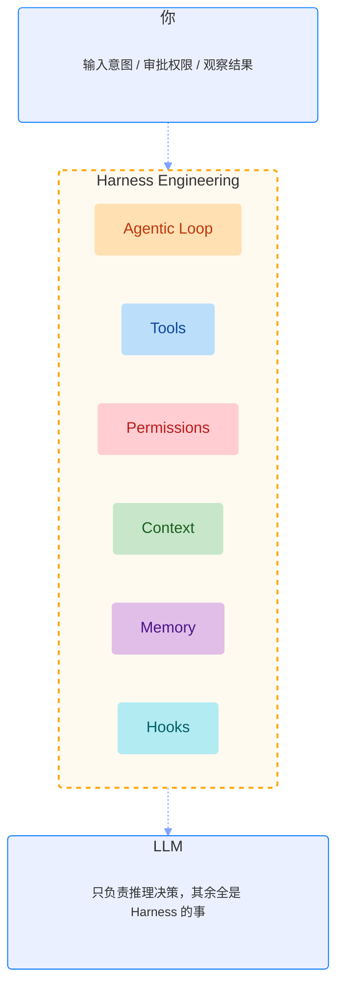
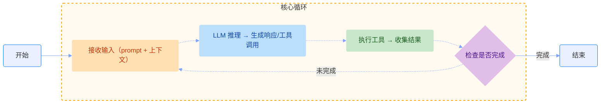
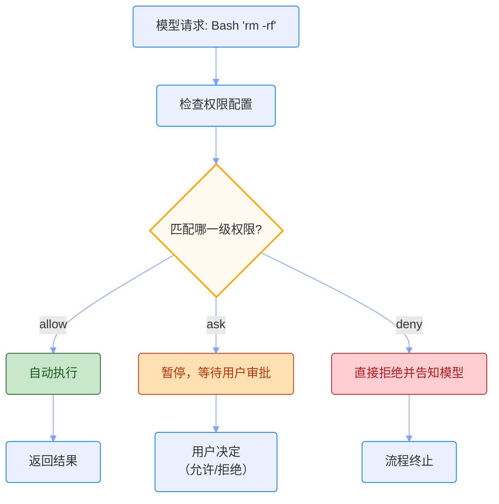

# Harness Engineering

理解 Agent 系统的关键，不在于 LLM 有多强，而在于包裹它的那套基础设施，也就是 Harness。这篇文章聊聊我对 Harness Engineering 的理解，从核心概念到六大组件，最后以 Claude Code 为例看看它在实际产品里是怎么落地的。

## 什么是 Harness Engineering

用一句话来描述：**Harness Engineering = 包裹 LLM 的运行时基础设施**。

LLM 本身只是个推理引擎，给它一个 prompt，它返回一段文字，仅此而已。但一个真正能做事的 Agent，需要工具调度、上下文管理、状态持久化、权限控制……这些 LLM 负责不了，全靠 Harness 来兜底。

**Agent = Model + Harness**



把 Harness 想象成一个"外骨骼"会更直观：LLM 是里面的大脑，负责推理和判断；Harness 是让大脑能够行动、记忆、与外界交互的整套系统。去掉 Harness，LLM 只是个聊天窗口；加上 Harness，它才能成为真正干活的 Agent。

## Harness 六大核心组件

Harness 的职责可以拆成六块，每一块都解决一个具体问题：

| 组件         | 职责                                    | 不做会怎样                         |
| ------------ | --------------------------------------- | ---------------------------------- |
| Agentic Loop | 推理 → 工具 → 回注 → 继续推理的核心循环 | 模型只能回答一次，无法完成复杂任务 |
| 工具系统     | Read/Write/Bash/Grep 等原子操作         | 模型只会说，不会做                 |
| 权限控制     | allow/deny/ask 细粒度管控危险操作       | 无法阻止 Agent 执行破坏性操作      |
| 上下文管理   | 自动压缩 + 关键信息重注入               | 长任务 token 爆炸或遗忘关键信息    |
| 状态持久化   | 对话历史、工具结果、跨会话记忆          | 断线重连后从头开始                 |
| 事件钩子     | 工具执行前后的自动化拦截                | 无法实现自动校验、自动通知         |

### Agentic Loop

这是整个 Harness 的心脏。没有 Loop，模型就是一问一答；有了 Loop，模型才能持续推理、反复行动，直到任务完成。



Loop 的逻辑很简单：模型推理 → 调用工具 → 结果回注 → 继续推理，周而复始，直到任务完成或达到最大轮次上限。"检查是否完成"这一步通常也是模型自己判断的，它读到足够的信息后，决定停下来给出最终答案。

### 工具系统（Tools）

工具是 Agent 的手脚。没有工具，模型只能输出文字，无法真正改变任何东西。

Harness 的工具设计有一个我很欣赏的哲学：**少而精，靠组合涌现能力**，而不是为每个场景单独造一个工具。

5 类原子操作基本覆盖一切：

| 操作                 | 工具                      |
| -------------------- | ------------------------- |
| 读 (Read)            | Read / Glob / Grep        |
| 写 (Write)           | Write / Edit              |
| 执行 (Execute)       | Bash（图灵完备）          |
| 联网 (Web)           | WebFetch / WebSearch      |
| 编排 (Orchestration) | Agent / TodoWrite / Skill |

遇到复杂场景怎么办？组合就够了：

| 场景             | 组合方式           |
| ---------------- | ------------------ |
| 没有"重构工具"？ | Read + Edit + Bash |
| 没有"测试工具"？ | Bash + Read        |
| 没有"部署工具"？ | Bash               |

> 正如计算机只需几条基础指令就能图灵完备，Harness 只需确保基础工具的组合空间足够大，就能应对任何复杂场景。

Bash 在这里是终极后手，图灵完备意味着任何可以程序化的操作都能搞定。当然，能力越大责任越大，Bash 也是最需要权限管控的工具。

### 权限控制（Permissions）

做 Agent 系统会遇到一个根本矛盾：**希望 Agent 足够自主来提效，又担心它失控造成损失**。

权限控制的价值就在于：**在安全的边界内，给 Agent 最大程度的自主**。

三级权限模型：

| 权限等级 | 含义 | 效果                     | 设计思路           |
| -------- | ---- | ------------------------ | ------------------ |
| allow    | 允许 | 自动执行，无需审批       | 授予信任，保障流畅 |
| ask      | 询问 | 暂停，等待用户确认后继续 | 重要操作，人工把关 |
| deny     | 禁止 | 完全拒绝，直接告知模型   | 设置红线，绝对安全 |

以 Bash 为例，精细到命令级别的控制：

| 类型     | 示例                               |
| -------- | ---------------------------------- |
| allow    | `['npm test', 'npm run lint']`     |
| deny     | `['rm -rf', 'curl \| sh', 'sudo']` |
| 其余操作 | 自动归为 ask，等用户确认           |

> **核心原则**：默认禁止，按需允许。

决策流程：



权限控制的本质不是限制能力，而是明确边界，**能力越大，围栏越重要**。

### 上下文管理（Context）

这是 Agent 做长任务时绕不过去的工程难题。

**问题**：模型的 token 窗口是有限的（比如 200K），但真实任务产生的对话历史会很快把它填满。读 20 个文件、搜索 50 次、执行 30 个命令，这些工具调用的输入输出加在一起，轻松超过几十万 tokens。

**解法**：自动压缩 + 关键信息重注入。

| 阶段       | 策略                                         |
| ---------- | -------------------------------------------- |
| 触发机制   | 对话历史达到 token 窗口约 92% 时自动触发（这是 Claude Code 的阈值，不同产品可能不同）     |
| 压缩策略   | 保留最近消息保持完整性，将早期消息压缩成摘要 |
| 重注入内容 | CLAUDE.md、系统提示词、工具定义等关键配置    |

压缩的核心取舍是：牺牲历史细节，换取继续执行的能力。Harness 保证无论对话多长，任务关键信息始终在窗口内。

### 状态持久化（Memory）

Context 解决的是"当前会话内记得住"，Memory 解决的是"下次还记得"。

两者的区别很清晰：

| 概念    | 定义                 | 特性               |
| ------- | -------------------- | ------------------ |
| Context | 一次会话内的工作记忆 | 临时性、会话内有效 |
| Memory  | 跨会话的长期记忆     | 持久性、跨会话保留 |

Memory 又分两种写法：

| 类型                           | 说明                                                                            |
| ------------------------------ | ------------------------------------------------------------------------------- |
| **显式记忆**（用户主动写入）   | CLAUDE.md（项目级规则）、Skills/Hooks 配置，每次会话自动加载，压缩后重注入      |
| **隐式记忆**（Agent 自动存储） | 存储在 `~/.claude/` 下的项目记忆目录，包含用户偏好、操作反馈，跨项目/会话持久化 |

我自己的理解是：CLAUDE.md 像使命宣言，告诉 Agent "你是谁、该怎么干"；隐式记忆像学习笔记，记录"这个用户喜欢什么、上次踩过什么坑"。两者合在一起，才构成完整的长期记忆体系。

没有 Memory 的 Agent 每次对话都从零开始，无法积累经验，用起来很割裂。

### 事件钩子（Hooks）

Hooks 是 Harness 里我觉得最"工程味"的设计，它把那些**不需要模型思考、但必须做的事**从推理链路里剥离出来，用确定性的自动化来完成。

**本质**：事件驱动的自动化拦截，在工具执行的前后触发，不经过模型推理。

四个钩子覆盖了主要时机：

| 钩子                     | 作用                     |
| ------------------------ | ------------------------ |
| PreToolUse（执行前）     | 拦截、修改或阻止工具调用 |
| PostToolUse（执行后）    | 校验结果、执行审计       |
| Notification（通知事件） | 发送告警、记录日志       |
| Stop（Agent 结束时）     | 执行清理、生成汇报       |

Hooks 和 Tools 的根本区别：

| 特性       | Tools              | Hooks                        |
| ---------- | ------------------ | ---------------------------- |
| 调用方式   | 模型主动决策后调用 | 自动触发，不经过模型推理     |
| token 消耗 | 消耗推理 token     | 确定性操作，不消耗推理 token |

典型场景：

- 代码保存前自动格式化（prettier）
- 代码提交前自动 lint
- 生成文件后自动跑测试
- 修改配置后自动校验

一个完整的事件流长这样：

```
模型请求：Edit file.ts
  ↓
PreToolUse Hook（执行前拦截）
  → 检查目标文件是否为敏感文件
  → 确认安全后放行
  ↓
执行工具：Edit
  ↓
PostToolUse Hook（执行后处理）
  → 自动调用 prettier 格式化文件
```

## Harness 解决的五个 AI 落地卡点

这六个组件不是凭空设计的，背后都在解决 Agent 落地时真实遇到的问题：

| 问题                                 | 解决方法                    |
| ------------------------------------ | --------------------------- |
| 无限循环（Agent 陷入死循环烧 token） | max_turns 限制 + 循环检测   |
| 上下文爆炸（长任务超出窗口）         | 自动压缩 + 关键信息重注入   |
| 权限失控（Agent 执行危险操作）       | allow/deny/ask 细粒度管控   |
| 质量不可控（输出质量参差不齐）       | Hooks 自动校验 + 审核 Agent |
| 成本不透明（token 消耗无感知）       | 实时计量 + 用量可观测       |

## Claude Code：一个标杆 Harness 的设计哲学

Claude Code 是目前我用过最典型的 Harness 实现，它的设计思路值得单独说一下。

**核心原则：少而精，组合涌现**

它不内置"重构工具"、"测试工具"这些高层概念，而是提供十几个覆盖读、写、执行、联网、编排五类原子操作的基础工具，让复杂能力从组合中自然涌现。

**三个关键设计**

| 特性                | 说明                                                                         |
| ------------------- | ---------------------------------------------------------------------------- |
| Bash 作为"万能底牌" | 图灵完备的终极手段，覆盖所有未被内置工具支持的场景；搭配精细权限控制确保安全 |
| 上下文管理          | 自动压缩 + CLAUDE.md 重注入，解决长上下文任务的信息管理问题                  |
| 递归任务分解        | 支持创建具备隔离上下文的 Sub-Agent 进行递归调用，处理复杂或需拆分的大任务    |

Bash 作为"万能底牌"这个设计我特别认同，它承认没有工具能穷举所有场景，所以保留一个图灵完备的出口，把边界问题交给用户和权限系统来把控，而不是试图用工具数量去堆砌覆盖率。
