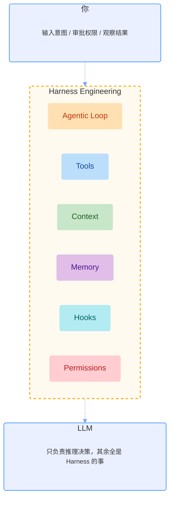
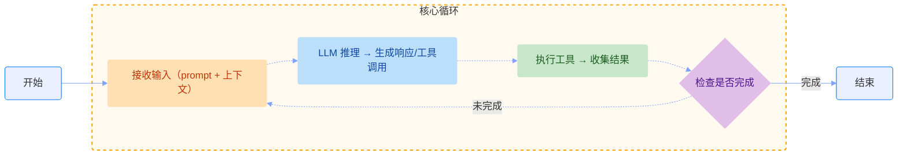

# Harness Engineering

## 什么是 Harness Engineering

一句话定义：Harness Engineering = 包裹 LLM 的运行时基础设施。包含管理工具调度、上下文工程、安全执行、状态持久化、会话连续性等，LLM 只负责推理决策，其余全是 Harness 的事情。

Agent = Model + Harness

## Harness 六大核心组件

| 组件         | 职责                                                     | 不做会怎样                         |
| ------------ | -------------------------------------------------------- | ---------------------------------- |
| Agentic Loop | 推理 → 工具 → 回注 → 继续推理的核心循环                  | 模型只能回答一次，无法完成复杂任务 |
| 工具系统     | Read/Write/Bash/Grep 等原子操作                          | 模型只会说，不会做                 |
| 上下文管理   | 自动压缩 + 关键信息重注入                                | 长任务 token 爆炸或遗忘关键信息    |
| 状态持久化   | 对话历史、工具结果、会话恢复                             | 断线重连后从头开始                 |
| 事件钩子     | 工具执行前后的自动化拦截                                 | 无法实现自动校验、自动通知         |
| 权限控制     | allow/deny/ask 细粒度控制 Agent 执行危险操作（rm -rf /） | 无法控制危险操作                   |

### Agentic Loop

