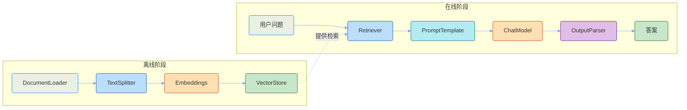
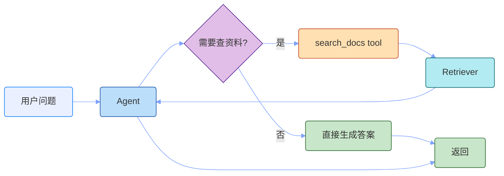

# LangChain

RAG 那篇把"为什么需要 RAG"和"链路怎么拆"讲清楚了。这篇文章解决怎么用 LangChain.js 把那条链路落成代码，并把检索能力挂到 agent 上。

读完以后你能拿到：

- 一条能跑通的最小 RAG 链路（TypeScript + LangChain.js）；
- 把检索封装成 tool、用工具调用 agent 调起来的写法；
- 几个工程上最常踩的坑和调优点。

目标很简单：看完能把"LangChain 这几个组件对应 RAG 链路哪一段"放到一起，不再是各记各的 API。

## LangChain 是什么

LangChain 是一个 LLM 应用框架。它本身不提供 LLM，核心价值是把"接 LLM"这件事标准化，把检索、工具、记忆、链式调用这些高频模式抽成可复用组件。

它要解决的核心问题是：让你不用每次都从零写一遍 prompt 拼接、输出解析、上下文管理这些样板代码。

更具体一点，LangChain 提供的几类核心抽象，正好对应 RAG 链路上的关键节点：

| 抽象                | 解决的问题                          | 对应 RAG 链路节点      |
| ------------------- | ----------------------------------- | ---------------------- |
| `Document` / Loader | 把各种来源的原始内容读成结构化文档  | 离线：数据接入         |
| `TextSplitter`      | 把长文档拆成适合检索的小块          | 离线：切块             |
| `Embeddings`        | 把文本变成向量                      | 离线：向量化           |
| `VectorStore`       | 存向量、做相似度检索                | 离线：建索引 / 在线：召回 |
| `Retriever`         | 标准化的检索接口（向量/关键词/混合） | 在线：召回             |
| `PromptTemplate`    | 提示词模板化和变量注入              | 在线：上下文组装       |
| `ChatModel`         | 统一各家 LLM 调用方式               | 在线：生成             |
| `OutputParser`      | 把模型输出解析成结构化字段          | 在线：生成             |
| `Tool` / `Agent`    | 让模型按需调用工具                  | 在线：调度             |

把这条对应关系看清楚，后面写代码就是在按链路填空。



## 离线阶段：把文档接进向量库

离线阶段的目标，是把"原始文档"变成"可被稳定检索的知识单元"。这一段在 RAG.md 里讲过为什么，这里只关心怎么做。

### 整体链路

```text
源文件 → DocumentLoader → Document[]
      → TextSplitter   → Chunk[]
      → Embeddings      → 向量
      → VectorStore     → 写入索引
```

### 1. 文档加载

`DocumentLoader` 把各种来源的原始内容读成统一的 `Document` 对象（`pageContent` + `metadata`）。

```typescript
import { TextLoader } from "langchain/document_loaders/fs/text"
import { PDFLoader } from "langchain/document_loaders/fs/pdf"

const textDocs = await new TextLoader("docs/intro.md").load()
const pdfDocs = await new PDFLoader("docs/handbook.pdf").load()
```

工程里实际要关心的不是哪个 loader，而是**加载阶段最容易丢东西**：

- PDF 解析顺序错乱、表格被拆坏；
- Markdown 标题层级丢失；
- 网页正文里混进导航、广告、页脚。

如果这一步做差了，后面召回通常也不会好。

### 2. 切块

`TextSplitter` 把长文档拆成适合检索的小块。这一步直接决定 RAG 的上限。

```typescript
import { RecursiveCharacterTextSplitter } from "langchain/text_splitter"

const splitter = new RecursiveCharacterTextSplitter({
  chunkSize: 500,
  chunkOverlap: 50,
  separators: ["\n## ", "\n### ", "\n\n", "\n", " ", ""],
})

const chunks = await splitter.splitDocuments(docs)
```

几个常见参数的取舍：

| 参数            | 取值范围      | 调大后果               | 调小后果           |
| --------------- | ------------- | ---------------------- | ------------------ |
| `chunkSize`     | 200 ~ 1000    | 噪声多、关键信息被淹没 | 语义不完整         |
| `chunkOverlap`  | 0 ~ chunkSize | 重复内容变多           | 边界处上下文断裂   |
| `separators`    | 按结构排      | 切坏结构               | 切到不该切的位置   |

工程经验：**结构优先，长度兜底，必要时加少量 overlap**。如果文档是 Markdown，可以先用 `MarkdownHeaderTextSplitter` 按标题切，再用 `RecursiveCharacterTextSplitter` 按长度补切，效果比单层切好很多。

### 3. 向量化与入库

```typescript
import { OpenAIEmbeddings } from "@langchain/openai"
import { MemoryVectorStore } from "langchain/vectorstores/memory"

const embeddings = new OpenAIEmbeddings({
  model: "text-embedding-3-small",
})

const vectorStore = await MemoryVectorStore.fromDocuments(chunks, embeddings)
```

选型上有几个分叉：

- **Embedding 模型**：`text-embedding-3-small` 便宜够用，私有部署可以选 `HuggingFace` 上的开源模型；
- **VectorStore**：开发期用 `MemoryVectorStore` 就够了，生产至少要换成 `Chroma` / `FAISS` / `PGVector` / `Pinecone` 这类带持久化和并发支持的实现；
- **关键词索引**：错误码、接口名、版本号这类问题，关键词匹配常常比纯语义匹配更稳。生产里通常会做"向量 + 关键词"混合召回，而不是只用向量。

完整代码串起来：

```typescript
import { TextLoader } from "langchain/document_loaders/fs/text"
import { RecursiveCharacterTextSplitter } from "langchain/text_splitter"
import { OpenAIEmbeddings } from "@langchain/openai"
import { MemoryVectorStore } from "langchain/vectorstores/memory"

async function buildIndex(filePath: string) {
  const docs = await new TextLoader(filePath).load()
  const splitter = new RecursiveCharacterTextSplitter({
    chunkSize: 500,
    chunkOverlap: 50,
  })
  const chunks = await splitter.splitDocuments(docs)
  const embeddings = new OpenAIEmbeddings()
  return MemoryVectorStore.fromDocuments(chunks, embeddings)
}
```

## 在线阶段：检索 + 生成

在线阶段的目标是：用户提了一个问题，把"正确资料"送到模型面前。这里用 LangChain 推荐的 LCEL（LangChain Expression Language）写法来拼链路。

### LCEL 是什么

LCEL 用 `|` 把 Runnable 串起来，每个环节的输入输出都是流式兼容的：

```typescript
const chain = prompt.pipe(model).pipe(outputParser)
const stream = await chain.stream(input) // 天然支持流式
```

相比旧的 `LLMChain`、`RetrievalQA` 这类高阶封装，LCEL 更灵活、调试更容易、可以无缝接 streaming/异步/batch，**新项目建议直接用 LCEL**。

### 搭建检索链

```typescript
import { ChatPromptTemplate } from "@langchain/core/prompts"
import { ChatOpenAI } from "@langchain/openai"
import { StringOutputParser } from "@langchain/core/output_parsers"
import { RunnablePassthrough, RunnableSequence } from "@langchain/core/runnables"
import type { Document } from "@langchain/core/documents"

const retriever = vectorStore.asRetriever({ k: 4 })

const prompt = ChatPromptTemplate.fromMessages([
  [
    "system",
    `你是一个问答助手。请严格根据下面提供的资料回答问题。
如果资料里没有答案，直接说"我不知道"，不要编造。
回答时在末尾用 [1][2] 这样的形式标注引用来源。`,
  ],
  ["human", "资料：\n{context}\n\n问题：{question}"],
])

const llm = new ChatOpenAI({ model: "gpt-4o-mini", temperature: 0 })

const formatDocs = (docs: Document[]) =>
  docs
    .map((d, i) => `[${i + 1}] ${d.pageContent}`)
    .join("\n\n")

const ragChain = RunnableSequence.from([
  {
    context: retriever.pipe(formatDocs),
    question: new RunnablePassthrough(),
  },
  prompt,
  llm,
  new StringOutputParser(),
])

const answer = await ragChain.invoke("什么是 RAG？")
```

几个值得注意的点：

- `retriever.pipe(formatDocs)` 把检索结果拍平成一段文本塞进 prompt；
- `RunnablePassthrough()` 透传原始 `question`；
- `temperature: 0` 减少回答的随机性，RAG 场景通常希望稳定输出；
- prompt 里**显式约束模型**"不知道就说不知道""给引用来源"，比指望模型自动守规矩可靠得多。

### 端到端调用

```typescript
const question = "退款被驳回后怎么走？"
const answer = await ragChain.invoke(question)
console.log(answer)
```

返回的就是带 `[1][2]` 引用标注的答案。

## 包成 agent：把检索挂成 tool

如果你的需求只是"输入问题，输出答案"，上面那条 RAG chain 已经够了。但很多真实场景里，模型需要：

- 先看用户问题，决定要不要查资料；
- 同时能调用其他工具（比如查订单、查天气、写文件）；
- 在多轮对话里保持上下文。

这就是 agent 的工作。下面把检索能力挂成 tool，用 LangChain 的工具调用 agent 调度起来。

### 整体结构



agent 自己判断要不要调用 tool，调完之后把结果回注到上下文再继续推理。**关键不是"agent 更聪明"，而是"模型可以决定走哪条路径"**。

### 把检索包成 tool

`tool` 的本质就是一个有名字、有描述、有入参 schema 的函数，模型通过描述决定要不要用、用哪个。

```typescript
import { tool } from "@langchain/core/tools"
import { z } from "zod"

const searchDocs = tool(
  async ({ query }: { query: string }) => {
    const docs = await retriever.invoke(query)
    return docs
      .map((d, i) => `[${i + 1}] ${d.pageContent}`)
      .join("\n\n")
  },
  {
    name: "search_docs",
    description: "从知识库中检索与问题相关的资料。问题涉及具体业务规则、流程、错误码时使用。",
    schema: z.object({
      query: z.string().describe("用于检索的关键词或问题"),
    }),
  }
)
```

两个常被忽略但影响巨大的细节：

- **`description` 是模型的"看名字选工具"的依据**。写得越具体，模型越知道什么时候该调、什么时候不该调；
- **`schema` 决定模型能传什么参数进来**。用 `zod` 显式定义，模型就会按 schema 传，类型也对得上。

### 调度 agent

```typescript
import { ChatPromptTemplate } from "@langchain/core/prompts"
import { ChatOpenAI } from "@langchain/openai"
import { createToolCallingAgent, AgentExecutor } from "langchain/agents"

const llm = new ChatOpenAI({ model: "gpt-4o-mini", temperature: 0 })

const agentPrompt = ChatPromptTemplate.fromMessages([
  [
    "system",
    `你是问答助手。先判断问题是否需要查资料，需要就调用 search_docs。
严格基于检索结果回答，资料里没有就直接说不知道，不要编造。`,
  ],
  ["human", "{input}"],
  ["placeholder", "{agent_scratchpad}"],
])

const agent = await createToolCallingAgent({
  llm,
  tools: [searchDocs],
  prompt: agentPrompt,
})

const executor = new AgentExecutor({
  agent,
  tools: [searchDocs],
  verbose: true, // 开发期打印中间步骤
})
```

注意两个点：

- `{agent_scratchpad}` 这个 placeholder 必填。agent 的中间步骤（哪一步调了 tool、调了什么、结果是什么）都靠它回填到下一轮 prompt；
- `verbose: true` 在开发期非常有用，能看到完整的"思考→调 tool→回注→再思考"过程。

### 完整代码

把上面串起来：

```typescript
import { ChatPromptTemplate } from "@langchain/core/prompts"
import { ChatOpenAI } from "@langchain/openai"
import { tool } from "@langchain/core/tools"
import { z } from "zod"
import { createToolCallingAgent, AgentExecutor } from "langchain/agents"
import type { Document } from "@langchain/core/documents"

async function buildRagAgent(vectorStore: MemoryVectorStore) {
  const retriever = vectorStore.asRetriever({ k: 4 })

  const formatDocs = (docs: Document[]) =>
    docs.map((d, i) => `[${i + 1}] ${d.pageContent}`).join("\n\n")

  const searchDocs = tool(
    async ({ query }: { query: string }) => {
      const docs = await retriever.invoke(query)
      return formatDocs(docs)
    },
    {
      name: "search_docs",
      description: "从知识库中检索与问题相关的资料。问题涉及具体业务规则、流程、错误码时使用。",
      schema: z.object({
        query: z.string().describe("用于检索的关键词或问题"),
      }),
    }
  )

  const llm = new ChatOpenAI({ model: "gpt-4o-mini", temperature: 0 })

  const agentPrompt = ChatPromptTemplate.fromMessages([
    [
      "system",
      `你是问答助手。先判断问题是否需要查资料，需要就调用 search_docs。
严格基于检索结果回答，资料里没有就直接说不知道，不要编造。`,
    ],
    ["human", "{input}"],
    ["placeholder", "{agent_scratchpad}"],
  ])

  const agent = await createToolCallingAgent({
    llm,
    tools: [searchDocs],
    prompt: agentPrompt,
  })

  return new AgentExecutor({
    agent,
    tools: [searchDocs],
    verbose: true,
  })
}

// 使用
const vectorStore = await buildIndex("docs/handbook.md")
const executor = await buildRagAgent(vectorStore)

const result = await executor.invoke({ input: "退款被驳回后怎么走？" })
console.log(result.output)
```

到这里，agent 已经可以根据问题自己决定要不要查资料、查什么。后续要扩展更多 tool（比如查订单、调接口），只要在 `tools` 数组里追加就行。

## 最佳实践

RAG 链路能不能跑稳，关键不在 LangChain 用得多花，而在几个工程取舍。

### 1. 切块策略决定上限

切块是 RAG 链路里最容易被低估的一步，**先优化切块，再谈别的**。

常见做法：

- 不同文档类型用不同切块策略：Markdown 用 `MarkdownHeaderTextSplitter`，代码用按函数切；
- 先按结构切，再按长度补切：保住标题/段落完整性，长度只兜底；
- 调整 `chunkSize` 和 `chunkOverlap`：先用一组基线参数跑评测集，再围绕失败案例调。

很多时候，召回效果差不是 embedding 模型不行，而是 chunk 从一开始就被切坏了。

### 2. 检索别只用纯向量

向量检索对"语义相近"的问题很有效，但对错误码、接口名、版本号这类**字面精确匹配**的需求常常失灵。

更稳的做法是**混合召回**：

- 向量召回负责"问得不一样但意思一样"的情况；
- 关键词召回（BM25 / 全文索引）负责"问得就是那几个字"的情况；
- 两条路合并去重，再交给重排模型。

LangChain 里可以通过 `EnsembleRetriever` 把多条召回结果组合起来。

### 3. 观测要早做

RAG 链路涉及 embedding、检索、prompt 拼接、模型调用，任何一段出问题都很难凭感觉定位。**项目第一天就接上 LangSmith**，把每条链路的输入输出、耗时、token 消耗都记录下来。

配置走环境变量最简单，代码侧不需要额外改动：

```bash
export LANGCHAIN_TRACING_V2=true
export LANGCHAIN_API_KEY=lsv2_xxx
export LANGCHAIN_PROJECT=rag-agent
```

之后所有 `chain.invoke` / `executor.invoke` / `stream` 调用都会自动上报到 LangSmith。

后期排查"为什么这个问题答错了"，基本就是看 trace 找到出错的那一段。

### 4. streaming 和异步

真实产品里没人能接受 LLM 思考十几秒才出字。LangChain 链天然支持流式：

```typescript
const stream = await ragChain.stream("什么是 RAG？")
for await (const chunk of stream) {
  process.stdout.write(chunk)
}
```

agent 也能流式：

```typescript
const stream = await executor.streamEvents({ input }, { version: "v2" })
for await (const event of stream) {
  if (event.event === "on_llm_stream") {
    process.stdout.write(event.data.chunk.text ?? "")
  }
}
```

### 5. 成本与延迟

几个能直接降本的小动作：

- **嵌入缓存**：相同文本的 embedding 结果缓存下来，重复文档/重复 query 不重新算；
- **控制 topK**：k 越大越准但越慢，4~8 是常见起点；
- **控制上下文长度**：召回结果做截断，避免塞给模型的内容超过窗口的 60%~70%；
- **小模型优先**：意图判断、改写、简单问答用 `gpt-4o-mini` 级别就够，重排序、复杂推理再上更大的模型。

### 6. 类型与稳定性

JS 生态里 LangChain 的类型推导已经做得不错，但有几个坑值得提前知道：

- 优先用 ESM（`"type": "module"`），CJS 模式下部分包会有奇怪的兼容问题；
- `MemoryVectorStore` 只适合开发期，重启即丢，生产换 `Chroma` / `FAISS` / `PGVector`；
- 多个 OpenAI 兼容服务（自部署的 vLLM、Ollama 兼容接口等）可以走 `ChatOpenAI` 加 `configuration.baseURL` 复用同一份代码。

## 最后总结一下

如果把 LangChain 在 RAG 里扮演的角色讲到底，其实就两件事：

**把 RAG 链路上的关键节点，抽成可拼装的组件。**

具体落到代码上：

- 离线阶段：DocumentLoader 读文档、TextSplitter 切块、Embeddings 向量化、VectorStore 入库；
- 在线阶段：Retriever 召回、PromptTemplate 组装、ChatModel 生成、OutputParser 解析；
- 想要更灵活的调度：把检索挂成 tool，用 `createToolCallingAgent` + `AgentExecutor` 串起来。

真正决定项目质量的，还是链路上的工程取舍——切块策略、混合召回、观测覆盖、上下文控制——这些和用不用 LangChain 关系不大，但少了哪一项，RAG 都会变成"看起来像、实际上不稳"的玩具系统。
