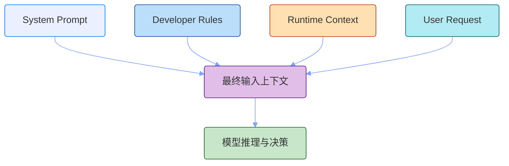

# 提示词工程

很多人一开始理解提示词工程时，容易把它等同于“会不会写几句像样的 prompt”。但真到项目里，你会发现问题根本不只是“怎么提问更礼貌”或者“怎么让模型多说一点”。

提示词工程真正要解决的，是另外一类问题：

- 同一个模型，为什么换一种说法结果差很多；
- 为什么 demo 跑得通，上线后却经常不稳定；
- 为什么模型明明“懂了”，但输出格式还是乱；
- 为什么它有时会擅自发挥，有时又抓不到重点；
- 为什么在 Agent 场景里，一旦接上工具和上下文，prompt 复杂度会陡增。

所以我更愿意把提示词工程理解成：**为模型设计一个清晰、稳定、可执行的任务接口**。

这篇文章会按下面这个顺序展开：

- 先说清楚提示词工程到底在解决什么问题；
- 再拆 prompt 实际上在影响模型的哪些行为；
- 然后讲一条 prompt 的基本组成和常见设计模式；
- 最后落到 Agent 场景和工程实践，讲分层、版本、评测和常见误区。

## 什么是提示词工程

如果只用一句话概括：

提示词工程不是“写一句让模型看懂的话”，而是系统地组织任务目标、上下文、约束和输出要求，让模型更稳定地完成任务。

这里有两个关键词：

- 系统地组织；
- 更稳定地完成任务。

“系统地组织”意味着它不是拍脑袋试一句、再试一句，而是有结构地设计输入。

“更稳定地完成任务”意味着它的目标不是偶尔答对，而是尽量降低随机性，提高可控性。

从这个角度看，提示词工程更像接口设计，而不像聊天技巧。

前端会设计组件接口，后端会设计 API 契约，数据库会设计表结构；提示词工程做的，是为模型设计交互契约。

## 为什么需要提示词工程

理解提示词工程，最好不要从“有哪些技巧”开始，而要从“如果不认真做，会出什么问题”开始。

### 1. 模型不是天然理解你的真实意图

用户脑子里的任务，和真正输入给模型的文本，中间隔着一层表达损耗。

你以为自己表达的是：

- “帮我总结重点，但不要丢掉关键约束”

模型可能理解成：

- “随便概括一下，大意对就行”

你以为自己表达的是：

- “按 JSON 输出”

模型可能理解成：

- “大致像 JSON 也可以”

提示词工程的价值，首先就是把隐含意图尽量显性化。

### 2. 同一个模型会因为表达方式不同而表现波动

大模型不是传统意义上的确定性程序。很多时候，任务目标没变，只是换了一种说法，结果就可能明显变化。

例如：

- 目标写得太抽象，模型容易抓不住重点；
- 约束写在段落深处，模型可能忽略；
- 示例分布和真实任务不一致，模型会被示例带偏；
- 输出格式要求不够明确，模型会“自己发挥”。

这也是为什么提示词工程不是“锦上添花”，而是稳定性建设的一部分。

### 3. 项目里追求的不是“能答”，而是“稳定答”

demo 阶段，很多 prompt 看起来都能跑。

但一旦放进真实业务里，要求马上会变化：

- 输入变复杂；
- 上下文变长；
- 用户表达不规范；
- 输出需要被程序消费；
- 错误代价变高。

这时你关心的就不再是“模型偶尔表现惊艳”，而是：

- 是否稳定；
- 是否可控；
- 是否可维护；
- 是否方便迭代。

而这些，基本都绕不开提示词工程。

## 提示词到底在影响什么

很多人会把 prompt 想成“给模型的一段说明文字”。这个理解太浅了。

更准确地说，prompt 在同时影响好几件事。

### 1. 影响任务理解

模型首先要判断：你到底要它做什么。

是总结、分类、改写、抽取、规划、问答、代码生成，还是工具调用？

如果任务定义模糊，模型往往会根据高频模式自己补全目标。问题在于，它补出来的目标不一定是你要的。

### 2. 影响注意力分配

输入里不是所有信息权重都一样。

你把什么放前面，什么强调，什么重复，什么用标题、列表、编号显式分区，都会影响模型把注意力放在哪里。

所以提示词工程并不只是“写什么”，也是“怎么排布”。

### 3. 影响行为边界

模型默认倾向于尽量给出一个像答案的答案。

如果你不明确告诉它：

- 什么时候该拒答；
- 什么时候该承认信息不足；
- 什么时候必须依赖给定上下文；
- 什么时候不能编造；

它就会用自己的默认策略补上这些空白。

### 4. 影响输出结构

自然语言输出和结构化输出，对 prompt 的要求完全不同。

如果你希望输出能被前端、后端、脚本、工作流消费，光说“请按 JSON 返回”通常不够，还需要把字段、类型、缺失时的行为、额外文本是否允许等规则写清楚。

### 5. 影响工具使用和决策路径

在 Agent 场景里，prompt 不只是控制“说什么”，还在控制：

- 什么时候调用工具；
- 优先调用哪个工具；
- 哪些情况必须先查证；
- 哪些操作需要停止并请求确认。

这时 prompt 已经不只是回答模板，而是行为策略的一部分。

## 一条 prompt 的基本组成

一个相对成熟的 prompt，通常不只是“一句命令”，而是由几个部分共同组成。

### 1. 任务目标

先明确要做什么。

例如：

- 总结一篇文档；
- 从客服对话中抽取工单字段；
- 根据给定上下文回答问题；
- 对代码做 review；
- 判断当前是否该调用工具。

任务目标越具体，模型越不容易误解。

### 2. 上下文

模型不能凭空知道你当前任务所处的环境，所以需要上下文。

上下文可能包括：

- 输入材料；
- 业务背景；
- 对话历史；
- 外部知识；
- 用户偏好；
- 当前工具执行结果。

很多“模型不聪明”的问题，其实是“上下文没给够”。

### 3. 约束

约束定义的是边界。

例如：

- 不要编造；
- 不要遗漏关键条件；
- 只基于提供材料回答；
- 信息不足时明确说明；
- 不输出解释，只输出结果；
- 不要调用高风险工具。

没有约束，模型就会默认按“尽量生成一个自然回答”的惯性行事。

### 4. 输出格式

如果结果要被人读，格式要求可以稍松一点；如果结果要被程序消费，格式要求就必须非常明确。

常见写法包括：

- 列表；
- 表格；
- 固定段落结构；
- JSON；
- 带字段说明的结构化对象。

输出格式越明确，后处理成本越低。

### 5. 示例

示例的作用不是“告诉模型答案”，而是校准它对任务的理解方式。

示例最常用来解决这些问题：

- 抽象要求不好说清；
- 输出风格需要统一；
- 边界条件容易误解；
- 需要演示“什么算好结果”。

但示例不是越多越好。示例太多、太长、分布不准，都可能带来副作用。

## 一个直观例子

假设你要做一个“根据知识库回答问题”的场景。

一个很原始的 prompt 可能是：

```text
请根据下面内容回答用户问题。
```

这句当然不是不能用，但它缺了很多信息：

- 如果上下文不足怎么办；
- 能不能补充外部知识；
- 要不要给引用；
- 答案是简洁还是详细；
- 如果上下文里有冲突该怎么处理。

一个更工程化一点的版本，通常会补上这些信息：

```text
你是一个知识库问答助手。请仅基于提供的上下文回答用户问题。

要求：
1. 如果上下文足够，给出准确、简洁的答案。
2. 如果上下文不足以支持结论，明确说明“根据当前提供的信息无法确认”。
3. 不要编造上下文中没有的信息。
4. 回答后附上所依据的引用编号。

上下文：
{{context}}

用户问题：
{{question}}
```

这时 prompt 做的事情就不只是“发起提问”，而是在定义回答协议。

## 常见设计模式

真正有用的提示词工程，往往不是记很多花样，而是掌握几个稳定模式。

### 1. 先把任务说具体，再谈风格优化

很多 prompt 最大的问题不是“不够高级”，而是“不够具体”。

比起一开始就追求语气、措辞、人格设定，更重要的是先把任务目标说明白：

- 输入是什么；
- 输出是什么；
- 成功标准是什么；
- 失败时怎么处理。

### 2. 先给上下文，再给动作

如果模型回答依赖材料、背景或中间结果，通常应该先给它读材料，再下动作指令。

也就是：

- 先告诉模型“你当前掌握了什么”；
- 再告诉它“基于这些信息你要做什么”。

这比把上下文和命令混在一起更稳定。

### 3. 显式写出边界条件

不要指望模型自动理解你的风险偏好。

像这些边界，最好直接写：

- 信息不足时不要猜；
- 无法确认时直接说明；
- 不能使用外部常识补全事实；
- 不满足条件时先提问澄清；
- 高风险动作前必须停下来确认。

### 4. 用示例校准，而不是堆示例

few-shot 的核心价值，是让模型看到：

- 这个任务的输入长什么样；
- 你期待的输出长什么样；
- 边界场景应该怎么处理。

好的示例通常具备两个特点：

- 和真实输入分布接近；
- 能覆盖最容易出错的情况。

### 5. 对复杂任务做步骤拆分

如果一个任务本身就包含多个子任务，直接一句话让模型全做完，通常不稳。

例如一个用户请求可能同时包含：

- 理解问题；
- 查资料；
- 对比证据；
- 得出结论；
- 按固定格式输出。

这时更稳妥的做法往往是显式拆步骤，让模型知道应该按什么顺序处理。

### 6. 让“不知道”成为合法输出

这是很多业务场景里非常重要的一条。

如果 prompt 只奖励“产出答案”，却没有允许“信息不足”，模型就更容易瞎补。

所以工程上经常会明确写出：

- 当证据不足时，优先承认不确定；
- 不要为了完整性编造内容；
- 缺失信息时说明缺什么。

## 从单轮问答到 Agent：提示词为什么会变复杂

普通聊天场景里，prompt 通常只控制一轮回答。

但到了 Agent 场景，prompt 要控制的事情更多了：

- 任务目标；
- 工具使用规则；
- 权限边界；
- 上下文来源；
- 记忆注入；
- 失败恢复策略；
- 最终输出格式。

所以 Agent 的提示词工程，复杂度天然更高。

### Agent 场景里的几层输入

可以把一个 Agent 的输入大致拆成几层：



这几层分别解决不同问题：

- System Prompt：定义总体角色、原则、长期规则；
- Developer Rules：定义产品级约束、工具使用方式、格式要求；
- Runtime Context：注入当前环境信息，例如工具结果、记忆、RAG 检索结果；
- User Request：当前这一次任务本身。

所以 Agent 的提示词工程，不是只写一段文案，而是在设计多层输入如何协同。

### 工具描述本身也是 prompt 的一部分

很多人会低估工具描述的重要性。

但在 Agent 系统里，工具名、参数定义、何时使用、返回值含义，这些都会直接影响模型决策。

换句话说，tool schema 也是提示词工程的一部分。

如果一个工具描述得很模糊，模型就更容易：

- 误用工具；
- 漏用工具；
- 参数传错；
- 在该停下确认时继续执行。

## 工程实践：怎么把提示词做成可维护系统

如果 prompt 只是临时写在代码里，很多问题还没暴露。

一旦它进入真实系统，工程问题就会马上出现。

### 1. 分层，不要把所有东西揉成一段大 prompt

最常见的问题之一，是把角色、规则、示例、业务背景、格式要求、错误处理全部糊在一个大段文本里。

这样做的问题是：

- 难读；
- 难改；
- 难定位哪一部分生效；
- 难做版本演进。

更好的方式通常是分层：

- 长期稳定规则单独放；
- 当前任务上下文单独注入；
- 输出格式要求单独定义；
- 示例单独维护。

### 2. 模板化

很多 prompt 并不是完全静态的，而是模板。

例如：

- `{{question}}`
- `{{context}}`
- `{{tool_result}}`
- `{{memory}}`

模板化的意义不是方便拼字符串，而是把“稳定结构”和“动态内容”分离开。

### 3. 版本管理

只要 prompt 会持续演进，它就应该被当成配置资产，而不是一次性文案。

需要管理的通常包括：

- 当前版本；
- 改动原因；
- 影响范围；
- 回滚方式；
- 和评测结果的对应关系。

否则过几轮迭代后，很容易出现“效果变了，但不知道是哪句改坏了”。

### 4. 用失败案例驱动迭代

提示词工程不能只靠主观感觉优化。

真正有效的迭代方式，通常是收集失败案例：

- 哪类问题经常答偏；
- 哪类输入格式最容易出错；
- 哪类 JSON 字段经常漏；
- 哪类工具调用最容易跑偏。

这些失败案例，是你后续优化 prompt 的主要依据。

### 5. 和评测绑定

如果 prompt 改了，却没有一套最小评测集，你基本无法判断是“真的变好”，还是“刚好这次看起来还行”。

所以成熟一点的流程通常会有：

- 固定测试样本；
- 关键场景 case；
- 结构化输出校验；
- 人工 spot check；
- 必要时做 A/B 对比。

### 6. 不要把所有问题都丢给 prompt 解决

这是很重要的一点。

有些问题看起来像 prompt 问题，其实不是：

- 知识缺失，应该交给 RAG；
- 实时信息获取，应该交给工具；
- 长任务遗忘，应该交给 memory 或 context 管理；
- 复杂业务流程，应该交给工作流编排；
- 输出强校验，应该配合结构化约束和程序校验。

提示词工程很重要，但它不是万能补丁。

## 常见误区

### 1. 把提示词当魔法咒语

有些讨论会把 prompt 写得像炼丹，仿佛某一句神秘表达就能突然提升所有效果。

现实里，大多数提升都来自更清晰的任务定义、更合理的上下文组织、更明确的边界和更好的工程配套。

### 2. 规则堆太多

规则不是越多越好。

如果一条 prompt 里塞了太多层层叠叠、彼此交错甚至互相冲突的要求，模型反而更难稳定执行。

写 prompt 也要有信息架构。

### 3. 说得很抽象，却以为模型会自动补全

比如：

- “请专业一点”
- “请全面分析”
- “请高质量输出”

这类话对人有感觉，对模型帮助有限。

真正有用的是把抽象要求翻译成可执行约束。

### 4. 示例很好看，但不接近真实输入

很多 few-shot 示例都过于理想化，和线上真实数据分布差很远。

这会导致模型在示例里表现很好，一到真实环境就掉线。

### 5. 把业务规则全塞给模型背

如果规则非常多、更新频繁、需要精准查证，靠 prompt 让模型“记住”通常不是好方案。

更合理的做法往往是：

- 规则放到知识库；
- 通过 RAG 检索；
- 或者直接由程序规则兜底。

## 提示词工程和 RAG、工具、工作流的关系

提示词工程不是孤立存在的，它通常和其他能力一起工作。

### 和 RAG 的关系

RAG 解决的是“把相关知识找出来”，提示词工程解决的是“把这些知识怎么交给模型，并约束它怎么用这些知识回答”。

没有 RAG，模型可能缺材料；没有好的 prompt，模型可能拿着材料也答得不稳。

### 和工具的关系

工具提供能力，prompt 提供使用策略。

工具决定“能不能做”，prompt 决定“什么时候做、先做什么、做到什么程度”。

### 和工作流的关系

工作流适合把复杂过程拆成显式步骤，提示词工程适合优化每一步里模型的行为。

所以很多稳定系统最后都不是“全靠一个 prompt”，而是：

- 工作流拆阶段；
- 每个阶段有自己的 prompt；
- 外部系统负责校验和兜底。

## 最后的理解

如果只用一句话概括，我会这样理解提示词工程：

提示词工程的本质，是把原本模糊的人类意图，翻译成模型更容易稳定执行的任务接口。

它解决的，不只是“让模型回答更好看”，而是：

- 让任务理解更清晰；
- 让行为边界更明确；
- 让输出格式更稳定；
- 让工具和上下文协作更可靠；
- 让整套系统更可调、更可测、更可维护。

所以在真实项目里，提示词工程不是一个小技巧集合，而是 LLM 系统设计的一部分。
