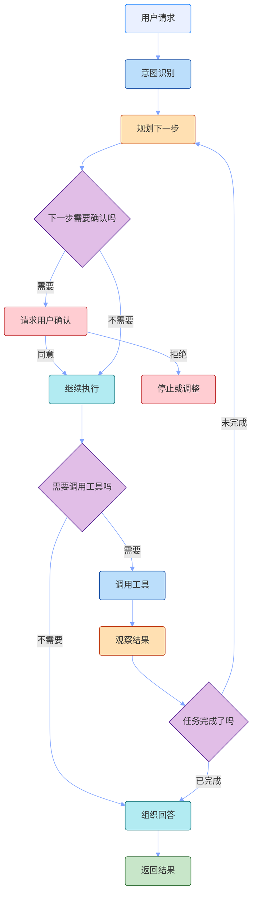

# 提示词工程

提示词工程很容易被讲玄。有人把它说成“写 prompt 的技巧”，有人把它讲成一堆固定句式，好像只要背几段模板，模型就会突然听话。

真实项目里不是这样。提示词工程真正要处理的，是模型和业务之间那层不稳定的接口：用户说得不完整，材料给得不整齐，输出还要被系统继续消费。prompt 写得松一点，模型就会自己补；补得像，不代表补得对。

所以我更愿意把提示词工程看成一件很朴素的事：**把任务说清楚，把边界写明白，把输出约定好。** 它不是为了写出一段看起来很厉害的话，而是让模型少猜一点。

## 先把概念放准

prompt 不是一句命令，而是模型这次工作的任务说明。它至少要回答几个问题：

- 这次要完成什么任务；
- 可以参考哪些上下文；
- 哪些事情不能做；
- 信息不够时怎么处理；
- 最后按什么格式交付。

如果这些都没说清楚，模型就会按自己的习惯来。它可能会补背景、补原因、补结论，甚至补一个看起来很完整但没有依据的答案。

从这个角度看，提示词工程不像聊天技巧，更像接口设计。接口不清楚，调用方和实现方都会猜；prompt 不清楚，模型也会猜。

## 为什么项目里绕不开它

很多 prompt 在 demo 里看起来都还行，因为 demo 的输入通常干净，任务也简单。你问得明确，模型答得也顺。一到真实场景，问题就来了。

### 1. 用户不会按你的理想方式提问

用户常常只说半句话。比如一句“总结一下”，背后可能是：

- 只保留关键结论；
- 不要漏掉限制条件；
- 按业务视角整理；
- 不要写得太像报告。

这些要求如果不写出来，模型只能猜。猜对一次不难，稳定猜对就很难。

### 2. 上下文越长，越需要秩序

模型不是把所有输入平均看一遍。材料放在哪里、规则怎么分组、重点有没有单独列出来，都会影响它怎么理解任务。

把背景、规则、示例、输出格式混成一大段，短任务也许还能跑，复杂任务就很容易丢重点。

### 3. 输出不只是给人看的

很多业务里，模型输出后面还要进流程。可能要被前端展示、被后端解析、被工作流判断，或者继续交给下一个模型步骤。

这时“差不多像 JSON”“大概按表格写”都不够。格式不稳，后面系统就要不停兜底。

### 4. 模型默认会给答案

这是最容易被低估的一点。模型很擅长生成一个像答案的答案。除非你明确允许它说“不知道”，否则它经常会为了完整性把空白补上。

在闲聊里这不算大问题，在知识库问答、客服、合规、代码变更这类场景里，就很危险。

## Prompt 到底在管什么

写一条 prompt，可以先按这个顺序看：先定任务，再放材料，然后写边界，最后约定交付。顺序不一定每次都完全一样，但这条线能帮你判断哪里没说清。


### 1. 先定任务

先让模型知道自己在做什么：是总结、分类、抽取、改写、问答、写代码，还是判断下一步要不要调用工具？

任务越抽象，模型越容易套用默认模式。比如“分析一下”这种说法，对人有感觉，对模型不够可执行。

### 2. 再放材料

材料就是模型回答时可以依赖的信息，也可以理解成这次任务的上下文。它可能来自用户输入、历史对话、RAG 召回结果、工具返回值，也可能是当前系统状态。

材料不是越多越好。给太少，模型只能猜；给太多，重点会被淹没。真正有用的是把相关材料放到模型容易读的位置。

### 3. 写清边界

边界决定模型什么时候该停。比如：

- 没有证据时不要补；
- 只基于给定材料回答；
- 无法确认时直接说明；
- 高风险操作前先请求确认；
- 不满足条件时不要继续执行。

这些话看起来简单，但很关键。很多线上问题不是模型不会做，而是它不知道什么时候不该做。

### 4. 约定交付

交付就是输出结构。给人看的内容，可以是段落、列表、表格；给程序看的内容，就要写清字段、类型、缺失值、是否允许额外解释。否则输出一旦漂移，后面解析就会变成一堆补丁。

## 一个例子

假设你在做知识库问答。最粗的写法可能是：

```text
请根据下面内容回答用户问题。
```

这句话能跑，但边界太少。它没有说上下文不足怎么办，没有说能不能用外部知识，也没有说要不要引用来源。模型很可能会把材料、常识和猜测混在一起。

更稳一点，可以这样写：

```text
你是一个知识库问答助手。请仅基于提供的上下文回答用户问题。

要求：
1. 如果上下文足够，给出准确、简洁的答案。
2. 如果上下文不足，回答“根据当前提供的信息无法确认”。
3. 不要编造上下文中没有的信息。
4. 回答后附上引用编号。

上下文：
{{context}}

用户问题：
{{question}}
```

这个版本不只是“问得更礼貌”，而是把回答规则写清楚了。

## 几个好用的写法

提示词工程不需要堆很多花活。落地时可以先按下面这个顺序排查，比继续加规则更有效。

### 1. 先写任务，再写风格

很多人一上来就调语气，比如“专业一点”“简洁一点”“像专家一样”。这些不是没用，但它们排在后面。

先写清楚输入是什么、输出是什么、成功标准是什么、失败时怎么处理。任务没说清，风格再好也只是包装。

### 2. 材料和指令分开

如果任务依赖材料，最好先放材料，再写动作。不要把背景、用户问题、系统要求揉在一段里。模型能读，但不代表读得稳。

### 3. 明确允许“不知道”

业务问答里，“不知道”应该是合法输出。如果 prompt 只奖励“给答案”，模型就会倾向于补答案。把“不足以确认时怎么说”写清楚，能减少很多看似流畅的错误。

### 4. 示例要贴近真实输入

示例的作用是校准，不是撑场面。一个贴近真实数据、覆盖边界情况的示例，比五个漂亮但理想化的示例更有用。

### 5. 复杂任务拆开

如果一个任务里同时有理解、检索、判断、生成、格式化，不要指望一句话全包还能稳定。可以拆成几步，也可以拆成多个 prompt。该交给流程的交给流程，该交给模型的再交给模型。

## 到了 Agent，prompt 会变成行为规则

普通问答里，prompt 主要影响模型怎么说。Agent 不一样，接了工具、记忆、环境信息之后，prompt 还会影响模型怎么行动。

更关键的是，Agent 的 prompt 要约束几个决策点：怎么做意图识别，下一步怎么规划，什么时候要用户确认，什么时候可以调用工具，以及工具结果回来后是继续推进还是收束回答。这里不需要把完整 Agent 架构画出来，只要把 prompt 会影响的关键决策点讲清楚。



这时 prompt 要说清楚：

- 怎么识别用户意图；
- 下一步怎么规划；
- 哪些操作必须先确认；
- 什么时候可以调用工具；
- 工具结果回来后是继续推进还是收束回答；
- 最终结果怎么汇报。

工具描述也算 prompt 的一部分。工具名、参数、返回值、使用时机写得含糊，模型就容易误用、漏用，或者在该停下的时候继续往前冲。

## 工程上怎么维护

prompt 一旦进了系统，就别再当临时文案看。它会被反复改、反复评测，也会被不同场景复用。维护时可以按下面几步来。

### 1. 先分层

长期规则、当前上下文、输出格式、示例，最好分开维护。全塞进一段大 prompt，短期省事，后面会很难改；效果变了，也很难知道是哪一句影响了结果。

### 2. 再模板化

很多 prompt 都会注入动态内容，比如：

- `{{question}}`
- `{{context}}`
- `{{tool_result}}`
- `{{memory}}`

模板化不是为了拼字符串，而是让稳定结构和动态输入分开。

### 3. 留版本

prompt 会迭代，至少记录改了什么、为什么改、影响哪些场景、评测有没有变化。否则几轮之后，谁也说不清效果为什么变了。

### 4. 用失败案例改

优化时不要凭感觉润色。先看失败案例：是任务理解错了，材料没用好，边界没生效，格式不稳，还是工具调用跑偏。找到问题在哪一层，再改对应的 prompt，这样比到处加规则更有效。

### 5. 分清边界

最后也别让 prompt 背所有锅。有些问题不该靠 prompt 硬扛：

- 知识缺失，应该用 RAG；
- 实时信息，应该用工具；
- 复杂流程，应该用工作流；
- 长任务状态，应该做上下文管理；
- 强格式要求，应该配合程序校验。

prompt 能提高模型稳定性，但它不是万能补丁。

## 最后

如果只用一句话概括，我会这样理解提示词工程：

**提示词工程的本质，是把原本模糊的人类意图，翻译成模型更容易稳定执行的任务接口。**

它解决的，不只是“让模型回答更好看”，而是让任务理解更清晰、行为边界更明确、输出格式更稳定。到了 Agent 场景，它还会影响工具和上下文怎么协作，以及系统什么时候该继续、什么时候该停下来。

所以在真实项目里，提示词工程不是一个小技巧集合，而是 LLM 系统设计的一部分。
