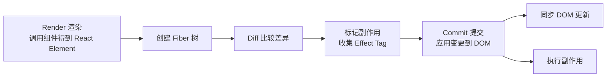

# React 渲染机制

## 整体流程



## 各阶段详解

### 1. Trigger (触发)

| 触发类型         | 说明                             |
| ---------------- | -------------------------------- |
| 首次渲染 (Mount) | ReactDOM.render() / createRoot() |
| State 更新       | setState / useState              |
| Props 更新       | 父组件传递的新 props             |
| ForceUpdate      | forceUpdate() 强制更新           |

### 2. Render (渲染)

```
Component.render() ──▶ 生成 React Element ──▶ 构建 Fiber 树

决定因素: this.state / this.props / context
```

### 3. Reconcile (调和)

Diff 算法比较新旧 Fiber 树：

| 情况              | 处理         |
| ----------------- | ------------ |
| Element 类型相同  | 更新属性     |
| Element 类型不同  | 替换整个子树 |
| 旧 Element 不存在 | 创建新节点   |
| 新 Element 不存在 | 删除旧节点   |

**双缓存 (Double Buffering):**

```
┌────────────┐      ┌────────────┐
│   current   │ ──▶ │ workInProgress │
│  (已提交)   │      │  (正在构建)  │
│  Fiber 树   │      │  Fiber 树    │
└────────────┘      └────────────┘
```

### 4. Commit (提交)

| 阶段               | 说明                  |
| ------------------ | --------------------- |
| BeforeDOM Mutation | 读取 DOM 状态（布局） |
| DOM 更新           | 同步执行 DOM 操作     |
| AfterDOM Mutation  | 布局计算完成后触发    |

**副作用执行顺序:**

1. `useLayoutEffect` 同步执行
2. DOM mutation
3. `useEffect` 异步执行

## 关键概念

| 概念              | 说明                                   |
| ----------------- | -------------------------------------- |
| **Fiber**         | React 16+ 新的协调引擎，支持可中断渲染 |
| **Reconcile**     | 比较新旧 Fiber 树，计算最小更新        |
| **Commit**        | 同步执行 DOM 更新和副作用              |
| **Double Buffer** | 双缓存避免页面闪烁                     |

## 渲染优先级

```
┌─────────────────────────────────────────────────────────┐
│ 同步渲染优先级 (Synchronous)                              │
│  - Legacy Mode (React <= 17)                            │
│  - 一次性完成，不可中断                                   │
├─────────────────────────────────────────────────────────┤
│ 异步渲染优先级 (Concurrent)                               │
│  - React 18+ 并发模式                                     │
│  - 可中断，支持 Suspense、Streaming                       │
└─────────────────────────────────────────────────────────┘
```

## 与 Vue 的区别

| 对比项   | React          | Vue                 |
| -------- | -------------- | ------------------- |
| 渲染触发 | setState/props | reactive dependency |
| 模板编译 | JSX (编译时)   | SFC (编译时)        |
| 更新粒度 | 组件级         | 响应式追踪          |
| DOM 更新 | 批处理 + 异步  | 同步                |
