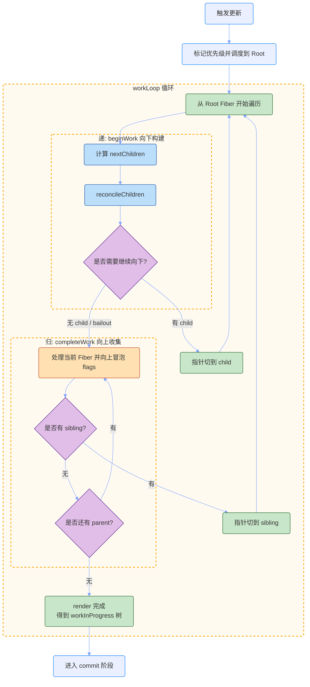

# React 渲染机制

React 的一次更新，整体可以理解成三步：

`触发更新 -> render -> commit`

- `触发更新`：把更新放进队列，标记优先级，并调度到 Root。
- `render`：构建新的 `workInProgress` 树，计算这次"要变什么"。
- `commit`：把 render 阶段已经算好的变更提交到宿主环境。

我的理解是：`render` 像是在算施工清单，`commit` 才是真正施工。前者（render 的计算部分）可以被打断、重做或跳过部分子树的计算；后者一旦开始，就要同步把结果提交完。

## Render 阶段

Render 阶段的核心，是 React 在同一个 workLoop 中以深度优先的方式遍历 Fiber 树。这个过程不是单纯从上到下扫描一遍，而是在遍历过程中交替处理两类工作：

- `递`：从父到子，进入节点，执行 `beginWork`。
- `归`：从子到父，回到节点，执行 `completeWork`。

这一阶段只负责计算，不直接操作真实 DOM。它的目标是构建这次更新对应的 `workInProgress` 树，同时收集并向上归并后续 commit 需要的副作用信息。以宿主组件为例，DOM 相关准备会在 `completeWork` 中完成：mount 时创建节点，update 时记录需要提交的变更。真正把这些变更落到页面上，则发生在 commit 的 `Mutation` 阶段。大致流程如下：

```mermaid
%%{init: {'themeVariables': {'lineColor': '#7fa3ff'}}}%%
flowchart TB
    A[触发更新]
    B[标记优先级并调度到 Root]

    subgraph WORKLOOP[workLoop 循环]
        direction TB
        D[从 Root Fiber 开始遍历]

        subgraph BEGIN[递: beginWork 向下构建]
            direction LR
            E[计算 nextChildren]
            H[reconcileChildren]
            I{是否需要继续向下?}
        end

        J[指针切到 child]

        subgraph COMPLETE[归: completeWork 向上收集]
            direction LR
            L[处理当前 Fiber 并向上冒泡 flags]
            N{是否有 sibling?}
            O{是否还有 parent?}
        end

        P[指针切到 sibling]
        Z[render 完成<br>得到 workInProgress 树]
    end

    U1[进入 commit 阶段]

    A --> B --> D
    D --> E
    E --> H
    H --> I
    I -->|有 child| J
    J --> D
    I -->|无 child / bailout| L
    L --> N
    N -->|有| P
    P --> D
    N -->|无| O
    O -->|有| L
    O -->|无| Z --> U1

    style WORKLOOP fill:#fffaf0,stroke:#ffa500,stroke-width:2px,stroke-dasharray:5,5,rx:4,ry:4
    style BEGIN fill:#fffaf0,stroke:#ffa500,stroke-width:2px,stroke-dasharray:5,5,rx:4,ry:4
    style COMPLETE fill:#fffaf0,stroke:#ffa500,stroke-width:2px,stroke-dasharray:5,5,rx:4,ry:4
    style A fill:#7fa3ff29,stroke:#07f,stroke-width:1px,rx:4,ry:4
    style B fill:#7fa3ff29,stroke:#07f,stroke-width:1px,rx:4,ry:4
    style D fill:#c8e6c9,stroke:#1b5e20,stroke-width:1px,rx:4,ry:4
    style E fill:#bbdefb,stroke:#0d47a1,stroke-width:1px,rx:4,ry:4
    style H fill:#bbdefb,stroke:#0d47a1,stroke-width:1px,rx:4,ry:4
    style I fill:#e1bee7,stroke:#4a148c,stroke-width:1px,rx:4,ry:4
    style J fill:#c8e6c9,stroke:#1b5e20,stroke-width:1px,rx:4,ry:4
    style L fill:#ffe0b2,stroke:#bf360c,stroke-width:1px,rx:4,ry:4
    style N fill:#e1bee7,stroke:#4a148c,stroke-width:1px,rx:4,ry:4
    style O fill:#e1bee7,stroke:#4a148c,stroke-width:1px,rx:4,ry:4
    style P fill:#c8e6c9,stroke:#1b5e20,stroke-width:1px,rx:4,ry:4
    style Z fill:#c8e6c9,stroke:#1b5e20,stroke-width:1px,rx:4,ry:4
    style U1 fill:#7fa3ff29,stroke:#07f,stroke-width:1px,rx:4,ry:4
```

接下来沿着 workLoop 的执行顺序，逐个拆开几个关键节点。

### 触发更新

入口来自 `setState`、`dispatch`、`root.render`、`startTransition` 这些调用。这里做的还不是渲染本身，而是先把更新放进对应 Fiber 或 Root 的更新队列。

这一层最关键的事情是两件：

- 记录这次更新的数据。
- 给这次更新分配优先级，并把调度请求交给 Root。

`触发更新` 更像是在说："这里有一笔新任务，先登记并交给调度器排期。"

### 调度准备（lane 优先级）

更新进入队列后，React 根据优先级把它映射到具体的 `lane`。Root 收到更新后，不会立刻开始整棵树遍历，而是先进入调度准备阶段：根据本次更新的优先级选出本轮要处理的 `lane`，并创建或复用这轮 render 对应的 `workInProgress` Root。

可以把它理解成 render 开跑前的准备动作：

- 这次先处理哪一批更新。
- 准备一棵 `workInProgress` 树，用来承接这轮 render 的计算结果。
- 当前 workLoop 从哪里开始恢复或重算。

这一步的结果，是把 render 需要的上下文准备好，让后面的 `beginWork` 有明确的起点。

### BeginWork

当 workLoop 取到某个 `workInProgress` 节点后，首先执行的是 `beginWork`。这一步是"向下递"时最核心的入口，主要负责读取当前节点这轮更新需要的输入，并决定子节点接下来该怎么算。

它通常会做这些事：

- 消费当前节点关联的更新队列。
- 读取新的 `props`、`state`、`context`。
- 执行函数组件或类组件对应的更新逻辑。
- 产出这一轮的 `nextChildren`。
- 判断这个节点是否可以直接 `bailout`。

所以 `beginWork` 的重点不是直接操作 DOM，而是先回答两个问题：

- 这个节点这轮有没有真的变。
- 如果变了，它的下一层 children 应该长什么样。

### Bailout

`bailout` 可以理解成：在当前优先级下，这棵子树不需要继续向下展开。

它发生在 `beginWork` 里。React 处理当前 `workInProgress` 节点时，会先判断这轮更新是否真的需要继续往下走。如果下面这些输入都没有变化，这个节点就可能触发 bailout：

- `props` 没变。
- `state` 没变。
- `context` 没变。
- `elementType` 没变。

触发 bailout 后，React 不会继续处理这棵子树下面的 `beginWork`，而是直接跳过这段向下展开的过程，转入后续的收尾路径。它的价值就是少做一段不必要的深度遍历。

不过要注意，`bailout` 不是"这棵子树彻底不管了"。它只跳过这轮优先级下不必要的向下展开，但 render 仍然要把这轮遍历正常收尾，保证 Fiber 结构、优先级和副作用信息是完整的。

### Reconcile

如果 `beginWork` 产出了新的 `nextChildren`，React 接下来就会进入 `reconcileChildren`。React 里常说的 diff，主要就发生在这里。

它不是拿两棵完整的树做全量比较，而是站在当前父节点视角，对"上一轮的子 Fiber"和"这一轮的 `nextChildren`"做同层比较。比较结果通常只有三类：

- 复用：`key` 和 `type` 能对上，复用旧 Fiber，进入 update。
- 新建：旧 Fiber 对不上这次的节点，创建新的 Fiber。
- 删除：旧节点这轮不需要了，给它打上删除相关标记。

这里最关键的判断依据是 `key` 和 `type`：

- `key` 先回答"这是不是同一层里的同一个节点"。
- `type` 再回答"它是不是同一种节点类型"。

只有 `key` 和 `type` 都能对上，React 才更有把握复用原来的 Fiber。否则就更可能走新建或删除。

这一轮比较完成后，React 会把新生成或复用出来的子 Fiber 赋给 `workInProgress.child` 。这样当前节点的下一层结构就确定了，workLoop 也就可以继续向下，进入子节点的 `beginWork`。

这个规则也解释了为什么列表里不应该随意用数组下标当 `key`。下标能让 React 在"位置没变"时看起来复用成功，但一旦列表中间插入、删除或重排，节点的身份（key）和类型（type）对不上，结果就是状态跟着错位到别的节点上。

### CompleteWork

当一个节点没有 child，或者其子树处理完毕，workLoop 就会开始"向上归"，进入 `completeWork`。

这一步更像当前 Fiber 的收尾阶段，主要做三件事：

- 对当前 Fiber 做本节点收尾。
- Host Fiber 在 mount 时准备宿主节点，在 update 时记录后续需要提交的变更。
- 把当前节点和子树上的 `flags / subtreeFlags` 向上冒泡给父节点。

`completeWork` 做完后，遍历还没结束。React 会先看有没有 `sibling`：

- 有 `sibling`，就切到兄弟节点，重新进入它的 `beginWork`。
- 没有 `sibling`，就继续回到父节点 `return`，执行父节点的 `completeWork`。

一直到 Root 也完成收尾，这一轮 Render 才算真正结束，并把结果交给后面的 Commit 阶段。

## Commit 阶段

当 render 阶段把整棵 `workInProgress` 树构建完后，React 进入 `commit`。这里不再做 diff，而是按照已经收集好的 `flags` 和 `subtreeFlags` 提交结果。大致流程如下：

```mermaid
%%{init: {'themeVariables': {'lineColor': '#7fa3ff'}}}%%
flowchart LR
    A[render 完成]

    subgraph COMMIT[commit 阶段]
        B[Before Mutation]
        C[Mutation]
        D[切换 current 指针]
        E[Layout]
    end

    F[浏览器绘制]
    G[Passive]
    H[完成]

    A --> B --> C --> D --> E --> F --> G --> H

    style COMMIT fill:#fffaf0,stroke:#ffa500,stroke-width:2px,stroke-dasharray:5,5,rx:4,ry:4
    style A fill:#7fa3ff29,stroke:#07f,stroke-width:1px,rx:4,ry:4
    style B fill:#ffe0b2,stroke:#bf360c,stroke-width:1px,rx:4,ry:4
    style C fill:#bbdefb,stroke:#0d47a1,stroke-width:1px,rx:4,ry:4
    style D fill:#c8e6c9,stroke:#1b5e20,stroke-width:1px,stroke-dasharray:5,5,rx:4,ry:4
    style E fill:#ffe0b2,stroke:#bf360c,stroke-width:1px,rx:4,ry:4
    style F fill:#7fa3ff29,stroke:#07f,stroke-width:1px,rx:4,ry:4
    style G fill:#7fa3ff29,stroke:#07f,stroke-width:1px,stroke-dasharray:5,5,rx:4,ry:4
    style H fill:#7fa3ff29,stroke:#07f,stroke-width:1px,rx:4,ry:4
```

Commit 阶段不会再重新计算 Fiber，而是按子阶段把 render 已经得出的结果真正提交出去。下面按执行顺序，逐一展开。

### Before Mutation

这一阶段发生在 DOM 变更之前。React 已计算出哪些节点需要插入、更新或删除，但还未向宿主环境提交变更。

这里最典型的工作，是在 DOM 变化前捕获快照，供后续阶段使用；类组件的 `getSnapshotBeforeUpdate` 就在这时执行。

这一阶段的核心不是"修改"，而是"在修改前再看一眼当前页面状态"。

### Mutation

`Mutation` 阶段才是真正把变更提交到宿主环境的地方。Render 阶段收集到的副作用标记，会在这里被逐个执行，所以它是 commit 中最接近"真正修改页面"的一段。

这一阶段的核心工作包括：

- 插入、更新、删除真实 DOM。
- 解绑旧 ref。
- 遍历将被删除的子树，完成组件卸载和相关清理；执行类组件的 `componentWillUnmount`。
- 执行旧的 `useLayoutEffect` cleanup。

### 切换 current

`Mutation` 完成后，React 将 Root 的 `current` 指针切换到刚完成的 `workInProgress` 树。

这一操作没有直接对应的生命周期或 Hook，但语义关键：render 阶段计算出的新树正式成为当前页面关联的 Fiber 树。到了 `Layout` 阶段，执行 `componentDidMount`、`componentDidUpdate` 时，通过 ref 等方式拿到的已是更新后的 DOM。

### Layout

`Layout` 阶段中，DOM 变更已经完成，但浏览器尚未完成当前帧绘制。这个阶段会处理那些需要基于"更新后 DOM"立即执行的逻辑：

- 读取更新后的 DOM；执行类组件的 `componentDidMount`、`componentDidUpdate`。
- 绑定新的 ref。
- 执行新的 `useLayoutEffect`。

因发生在绘制前，适合同步读取布局，或在用户看到页面前完成逻辑。

### Passive

`Passive` 阶段发生在浏览器绘制之后，以异步方式执行 passive effects。它的顺序很明确：先执行旧的 `useEffect` cleanup，再执行新的 `useEffect`。

这也解释了为何 `useEffect` 通常不阻塞页面绘制，更适合订阅、请求等不要求立即阻塞渲染的逻辑。

## 几个常见问题

### 1. React 是如何实现并发渲染的？中断后又是如何恢复的？

React 通过 `时间切片` 和 `优先级调度` 实现并发渲染。Render 过程中，React 会在 `workLoopConcurrent` 里周期性检查 `shouldYield()`；一旦当前时间片用尽，或者出现了更高优先级任务，就会先中断当前工作，把执行权让出去。

中断后，React 恢复 render 时会先检查这轮 render 的基准是否还成立，核心就是当前 Root 的 `current` 和本轮要处理的 `lanes` 是否与中断前一致。

- 如果 `current` 和 `lanes` 都没变，就继续沿用原来的 `workInProgress`，从中断处往下执行。
- 如果 `current` 或 `lanes` 已经变化，就基于最新的 `current` 和 `lanes` 重新进入 render，再在 `beginWork` 中通过 `bailout` 复用没变的部分。

### 2. React 每次触发渲染都是从根节点开始的吗？

从调度入口看，是的。某个组件触发更新后，React 会先把更新记录到对应 Fiber 的更新队列里，再把这次更新的 `lane` 一路向上标记到 Root。真正开始 render 时，React 会从 Root 准备本轮的 `workInProgress` 树，并从 Root Fiber 进入 workLoop。

但这不等于每次都会把整棵组件树重新计算一遍。Root 只是本轮 render 的统一入口，向下遍历时 React 会根据 `props`、`state`、`context`、`lanes` 等信息判断子树是否需要继续展开；如果某棵子树在当前优先级下没有变化，就可以通过 `bailout` 跳过它的向下计算。

所以更准确的说法是：更新会被调度到 Root，render 从 Root 开始，但实际计算会尽量只深入到这轮更新真正影响的子树。

### 3. WorkInProgress Fiber 和 Current Fiber 是什么关系？

可以把 `current` 理解成当前页面正在使用的 Fiber 树，把 `workInProgress` 理解成这次更新期间正在计算的新树。render 阶段一直在构建 `workInProgress`；等 commit 到切换 current 时，`workInProgress` 才会变成新的 `current`。

### 4. Mount 和 Update 是两套不同的机制吗？

`mount` 和 `update` 不是两套完全不同的机制，它们走的仍然是同一条主线：`beginWork -> reconcileChildren -> completeWork -> commit`。

差别主要体现在 render 阶段：

- `mount` 没有 `current`，需要创建新的 Fiber 和宿主节点信息。
- `update` 有 `current`，可以基于旧 Fiber 做复用、对比和 bailout。
- `update` 还要消费更新队列，比较新旧输入，并决定是否继续向下展开。

到了 commit 阶段，`mount` 主要是插入新节点，`update` 主要是增量修改真正变化的节点。可以把前者理解成"第一次把结构搭起来"，后者理解成"在旧结构上算这次该改哪里"。
