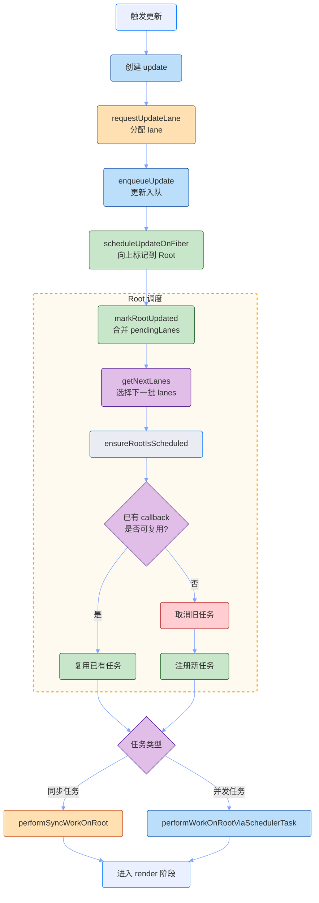
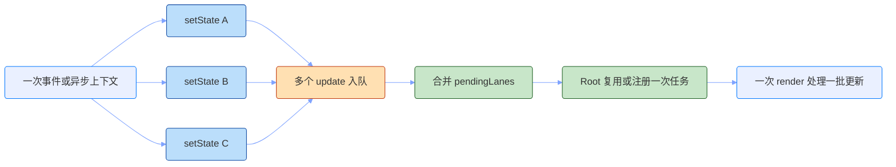

# React 调度机制

React 的一次更新，不是从 `setState` 直接跳到 render。它中间会先经过调度：React 需要登记这次更新，判断它有多紧急，把更新标记到 Root，再决定什么时候进入 render。

整体可以理解成这条主线：

`触发更新 -> 创建 update -> 分配 lane -> 标记到 Root -> 选择下一批 lanes -> 注册调度任务 -> 执行 render`

- `update`：描述这次更新要改什么。
- `lane`：描述这次更新属于什么优先级。
- `Root`：汇总整棵应用里待处理的 lanes。
- `Scheduler`：负责把可延迟的任务排到浏览器主线程上执行。

我的理解是：调度机制解决的是"什么时候做、先做哪一批、能不能被打断"；渲染机制解决的是"真正开始做以后，Fiber 树怎么计算、怎么提交"。

## 调度流程

React 调度的核心，是把不同组件上产生的更新统一收敛到 Root，再由 Root 选择下一轮 render 要处理的 lanes。这个过程不是简单地"有更新就立刻重渲染"，而是先登记、合并、排序，再执行。

大致流程如下：



这条链路可以拆成几个关键步骤。

### 1. 触发更新

入口可能来自 `setState`、`dispatch`、`root.render`、`forceUpdate`、`startTransition` 等调用。它们触发的位置不同，但最终都会生成一个 update，并进入对应 Fiber 或 Root 的更新队列。

这一步做的不是渲染，而是登记：

- 这次更新要表达什么。
- 这次更新属于什么优先级。
- 这次更新应该挂到哪棵 Root 上。

所以 `setState` 之后页面不一定立刻变化。它只是把一笔更新交给 React，后面还要看 lane、批处理和 Root 调度。

### 2. 分配 lane

React 会通过 `requestUpdateLane` 给 update 分配 lane。lane 可以理解成 React 内部的优先级通道。

不同来源的更新会进入不同 lane：

- 用户点击、输入等交互更新，优先级通常更高。
- `startTransition` 包裹的更新，会进入 transition 相关 lanes。
- 普通异步回调、数据更新，通常使用默认优先级。
- 同步刷新场景，会使用同步 lane。

简化逻辑如下：

```text
requestUpdateLane
  -> 判断当前是否处于同步上下文
  -> 判断当前是否处于 transition
  -> 读取当前事件优先级
  -> 返回对应 lane
```

lane 在 update 创建时就确定了。后续 Root 怎么选任务、render 阶段消费哪些 update、哪些子树可以 bailout，都要围绕本轮 `renderLanes` 判断。

### 3. 更新入队

分配好 lane 后，React 会创建 update，并把它放入对应队列：

- 函数组件的 `useState` / `useReducer`，进入 Hook queue。
- 类组件的 `setState` / `forceUpdate`，进入 class component update queue。
- `root.render`，进入 HostRoot update queue。

update 记录"要改什么"，lane 记录"以什么优先级处理"。调度阶段不会立刻消费 update，真正消费 update 队列通常发生在后续 render 的 `beginWork` 或 Hook 更新逻辑中。

### 4. 标记到 Root

组件上的更新不能只停留在当前 Fiber。React 会从触发更新的 Fiber 开始，沿着 `return` 指针向上，把这次更新的 lane 标记到父 Fiber，最终标记到 Root。

这一步的核心入口可以简化成：

```text
scheduleUpdateOnFiber(fiber, lane)
  -> markUpdateLaneFromFiberToRoot(fiber, lane)
  -> markRootUpdated(root, lane)
  -> ensureRootIsScheduled(root)
```

这里有两个结果：

- Root 的 `pendingLanes` 会合并这次更新的 lane。
- 沿途 Fiber 的 `childLanes` 会记录子树里有待处理更新。

这也解释了为什么 render 通常从 Root 开始：调度任务挂在 Root 上，React 需要从 Root 取出本轮要处理的 lanes，再准备对应的 `workInProgress` 树。

但从 Root 开始，不等于整棵树都会重新计算。render 向下走时，如果某棵子树在当前 `renderLanes` 下没有变化，就可以通过 `bailout` 跳过。

### 5. Root 选择下一批 lanes

Root 是调度的汇总点。它不只保存当前 Fiber 树，还保存了和调度有关的状态：

```text
root.pendingLanes      // 还有哪些 lanes 等待处理
root.suspendedLanes    // 哪些 lanes 当前被 Suspense 挂起
root.pingedLanes       // 哪些挂起 lanes 又被唤醒
root.expiredLanes      // 哪些 lanes 已经过期，需要尽快处理
root.callbackNode      // 当前已注册的调度任务
root.callbackPriority  // 当前调度任务对应的优先级
```

`ensureRootIsScheduled` 会先通过 `getNextLanes` 选择下一轮 render 要处理的 lanes。选择时会考虑：

- 哪些 lanes 还 pending。
- 哪些 lanes 被挂起，暂时不能处理。
- 哪些挂起 lanes 已经 ping，可以重试。
- 哪些 lanes 已经过期，需要提升紧急程度。
- 当前正在 render 的 lanes 是否还能继续复用。

最终选出来的是一组 lanes，而不是单个 lane。因为 React 可以在同一轮 render 中处理多个兼容优先级的更新。

### 6. 注册或复用调度任务

选出 `nextLanes` 后，React 会判断 Root 上现有 callback 是否还能复用。

简化逻辑如下：

```text
nextLanes = getNextLanes(root)

if 没有 nextLanes:
  取消已有 callback
  清空 root.callbackNode
  return

newPriority = getHighestPriorityLane(nextLanes)

if root.callbackPriority === newPriority:
  复用已有 callback
  return

取消旧 callback

if newPriority 是同步优先级:
  scheduleSyncCallback(performSyncWorkOnRoot)
else:
  schedulerPriority = lanesToSchedulerPriority(nextLanes)
  scheduleCallback(schedulerPriority, performWorkOnRootViaSchedulerTask)
```

这段逻辑解释了两个现象：

- 多次连续更新不一定注册多个任务，因为已有 callback 可能可以复用。
- 更高优先级更新插进来时，旧任务可能会被取消，换成更高优先级任务。

### 7. 进入 render

调度任务真正执行时，会进入两种入口之一：

- `performSyncWorkOnRoot`：同步任务，不走时间切片。
- `performWorkOnRootViaSchedulerTask`：Scheduler 调起的并发任务入口，可以被时间切片打断。

进入 render 后，React 会根据 Root 上选出的 lanes 准备 `workInProgress`，再进入渲染机制里的主流程：

`prepareFreshStack -> workLoop -> beginWork / completeWork -> commit`

到这里，调度完成了它的主要职责：决定本轮处理哪些更新，以及以同步还是并发方式进入 render。

## Lane 模型

Lane 是 React 调度模型的核心。它不是普通数字优先级，也不是队列，而是一套用 bitmask 表达的优先级集合。

### 位模型

每一条 lane 都占用一个 bit，多条 lanes 可以通过按位或合并到同一个数字里。

简化示意如下：

```text
SyncLane              = 0b0000000000000000000000000000010
InputContinuousLane   = 0b0000000000000000000000000001000
DefaultLane           = 0b0000000000000000000000000100000
TransitionLane1       = 0b0000000000000000000001000000000
TransitionLane2       = 0b0000000000000000000010000000000
```

如果 Root 上同时有同步更新和 transition 更新，就可以这样合并：

```text
pendingLanes = SyncLane | TransitionLane1
```

判断某条 lane 是否存在，也只需要按位与：

```text
includesSomeLane(pendingLanes, SyncLane)
  等价于 (pendingLanes & SyncLane) !== 0
```

这就是 lane 模型的第一个价值：用一个数字表达一组更新优先级，并且可以用位运算快速合并、筛选和删除。

### 优先级选择

Lane 模型中，通常越靠低位的 lane 优先级越高。React 可以通过取最低位的 1，快速拿到当前最高优先级 lane：

```text
getHighestPriorityLane(lanes)
  -> lanes & -lanes
```

例如：

```text
lanes = 0b101000
lanes & -lanes = 0b001000
```

这意味着 React 不需要遍历数组找最高优先级，只要做一次位运算，就能从一组 lanes 中取出最紧急的那条。

### Lane Group

某些类型的更新不是只有一条 lane，而是一组 lanes。例如 transition 有一组 transition lanes：

```text
TransitionLanes =
  TransitionLane1 |
  TransitionLane2 |
  TransitionLane3 |
  ...
```

这样多个 transition 更新可以分散到不同 bit 上，而不是全部挤到一条 lane 里。它们可以被区分、合并、挂起、唤醒或单独重试。

所以 lane 不只是"谁更紧急"，它同时表达三类信息：

- 优先级：哪类更新更紧急。
- 批次：哪些更新可以放在同一轮 render 中处理。
- 状态：哪些 lanes pending、suspended、pinged、expired。

### Lane 如何影响 render

调度选出的 lanes 会成为本轮 render 的 `renderLanes`。后续 render 阶段消费 update 队列时，会判断每个 update 的 lane 是否包含在 `renderLanes` 里。

例如一个 Fiber 的 update queue 中有两笔更新：

```text
update A: SyncLane
update B: TransitionLane
```

如果本轮 `renderLanes` 只包含 `SyncLane`，React 会先处理 update A；update B 会留在队列里，等 transition lanes 被选中时再处理。

这就是 lane 模型的关键：它不只是决定"谁先执行"，还决定"本轮 render 能看见哪些更新"。

## 调度优先级

React 中有两套相关但不同的优先级：

- Lane priority：React 更新模型里的优先级，决定本轮 render 处理哪些 updates。
- Scheduler priority：任务执行层面的优先级，决定 callback 在 Scheduler 队列里怎么排序。

Lane 是 Fiber 更新的概念，Scheduler priority 是 `scheduler` 包的任务概念。Root 先通过 lanes 选择下一批更新；如果这批更新需要通过 Scheduler 注册并发任务，React 会先把 lanes 转成 event priority，再转成 Scheduler 能理解的任务优先级。

注意，`scheduler` 包里仍然有 `ImmediatePriority`，但当前 React Root 调度里同步更新主要通过 microtask 末尾的同步 flush 处理，不再把同步 lane 映射成 `ImmediateSchedulerPriority` 去注册普通 Scheduler task。能走到 `performWorkOnRootViaSchedulerTask` 这条并发任务路径的 `DiscreteEventPriority` / `ContinuousEventPriority`，会使用 `UserBlockingSchedulerPriority`。

这里的 "microtask 末尾同步 flush" 可以理解成：同步更新不会被包装成一个普通的 Scheduler task 等待调度，而是先把 Root 放进 React 自己维护的待处理列表，然后预约一个 microtask。在当前 JavaScript 调用栈结束后，这个 microtask 会统一检查这些 Root，把其中仍然包含同步 lane 的 Root 立即刷掉。

简化流程如下：

```text
触发 SyncLane 更新
  -> ensureRootIsScheduled(root)
  -> 把 root 加入 React 的 root schedule
  -> 预约一个 microtask

当前调用栈结束
  -> microtask 执行
  -> flushSyncWorkAcrossRoots_impl()
  -> performSyncWorkOnRoot(root)
```

所以同步 lane 的"快"不再体现为 `Scheduler ImmediatePriority task`，而是体现为：React 在本轮事件后的 microtask 阶段立刻进入同步渲染入口 `performSyncWorkOnRoot`。这条路径不走时间切片，也不会通过 `performWorkOnRootViaSchedulerTask` 分段执行。

Scheduler 不关心 Fiber，也不关心 update 队列。它只关心 task 什么时候可以执行、什么时候过期。

不同 Scheduler priority 会对应不同 timeout：

```text
ImmediatePriority     timeout = -1
UserBlockingPriority  timeout = 250ms
NormalPriority        timeout = 5000ms
LowPriority           timeout = 10000ms
IdlePriority          timeout = 很大
```

注册任务时，Scheduler 会计算：

```text
startTime = currentTime + delay
expirationTime = startTime + timeout
```

然后把 task 放进小顶堆，按 `expirationTime` 排序。越早过期的任务越靠前执行。`ImmediatePriority` 的 timeout 是负数，所以它一注册就已经过期，会被尽快执行。

因此调度优先级的实现可以概括为：

- React 用 lanes 决定下一轮 render 处理哪些更新。
- React 把 lanes 映射成 Scheduler priority。
- Scheduler 用 `expirationTime` 给 task 排序。
- 执行 callback 时再回到 React 的 `performSyncWorkOnRoot` 或 `performWorkOnRootViaSchedulerTask`。

## 时间切片

时间切片是并发渲染能够"让出主线程"的关键。它不是浏览器自动帮 React 暂停 JavaScript，而是 React 在 workLoop 中主动检查是否应该暂停。

### 基本流程

同步 render 的 workLoop 更像这样：

```text
while (workInProgress !== null) {
  performUnitOfWork(workInProgress)
}
```

并发 render 的 workLoop 会多一个 `shouldYield()` 判断：

```text
while (workInProgress !== null && !shouldYield()) {
  performUnitOfWork(workInProgress)
}
```

`performUnitOfWork` 对应一个 Fiber 工作单元：进入当前 Fiber 的 `beginWork`，如果没有 child，就走 `completeUnitOfWork` 向上归。每完成一个单元，React 都有机会停下来。

### shouldYield

`shouldYield()` 由 Scheduler 提供。它的核心不是让浏览器强行打断 JavaScript，而是让 React 在每个 Fiber 工作单元之间主动判断：这一片连续执行时间是否已经超过预算。

简化后可以理解成：

```text
frameInterval = 5ms
startTime = 当前这一轮宏任务开始时间

while (workInProgress !== null) {
  performUnitOfWork(workInProgress)

  if (now() - startTime >= frameInterval) {
    break
  }
}
```

也就是说，一轮并发任务开始时，Scheduler 会记录当前时间作为 `startTime`。React 处理完一个 Fiber 工作单元后，才会回到 workLoop 检查一次 `shouldYield()`：如果还没超过预算，就继续处理下一个 Fiber；如果已经超过预算，就退出本轮 workLoop，把主线程还给浏览器。

这里的 `5ms` 是一片工作的默认预算，不是硬中断。浏览器不会在第 5ms 强行打断正在执行的 JavaScript，React 也不会在一个 Fiber 工作单元执行到一半时暂停。

所以如果某个组件自己的 render 逻辑非常耗时，React 也只能等这个函数执行完，才有机会让出主线程。

### 暂停与恢复

`shouldYield()` 只负责让 React 从本轮 workLoop 停下来，真正让下一段继续执行的是 Scheduler。

可以把一个 render 过程拆成三段来看：

```text
第 1 段执行
  -> 处理一批 Fiber
  -> shouldYield() 返回 true
  -> React 退出 workLoopConcurrent
  -> render 还没完成
```

此时会发生两件事。

第一，React 保留自己的 render 现场。比如当前处理到哪个 Fiber，会留在 `workInProgress` 指针上；本轮正在处理哪些 lanes，会保留在 `renderLanes` 里。

第二，Scheduler 保存"下次继续执行的入口"。React 注册给 Scheduler 的并发任务入口 callback 是：

```ts
scheduleCallback(schedulerPriorityLevel, performWorkOnRootViaSchedulerTask.bind(null, root))
```

如果本轮 callback 没有把当前 Root 的工作做完，React 会返回一个 continuation。Scheduler 发现 callback 的返回值还是函数，就不会把当前 task 视为完成，而是把这个函数保存起来，作为下次继续执行时的入口：

```ts
currentTask.callback = continuation // 也就是 performWorkOnRootViaSchedulerTask.bind(null, root)
```

保存这个入口之后，当前 task 仍然留在队列里。Scheduler 会通过 `MessageChannel` 给自己发一条消息，预约下一轮宏任务；等下一轮触发时，它再执行刚才保存的 continuation，重新进入 `performWorkOnRootViaSchedulerTask`。随后 React 会重新取本轮要处理的 lanes，并调用更底层的 `performWorkOnRoot` 回到真正的 work loop。

浏览器处理这条 `MessageChannel` 消息时，就会进入下一段：

```text
第 2 段宏任务触发
  -> Scheduler 执行 continuation
  -> 回到 performWorkOnRootViaSchedulerTask
  -> React 检查当前 render 是否还能继续
```

如果 Root 的 `current` 没变，本轮 lanes 也仍然匹配，React 就沿用之前的 `workInProgress`，从上次停下的位置继续处理剩余 Fiber。如果期间有更高优先级更新先提交了，导致 `current` 或 lanes 条件变化，React 就会基于最新 Root 重新准备 render。

所以第二段不是等"有别的任务插入"才恢复。即使没有任何其它任务，Scheduler 也会在发现任务没做完时，主动用 `MessageChannel` 预约下一轮执行。下一轮进来后，React 再决定是继续之前的 `workInProgress`，还是基于最新状态重做。

完整流程可以串起来看：

```text
第 1 段
  -> shouldYield() 返回 true
  -> React 保留 workInProgress / renderLanes
  -> Scheduler 保存 continuation
  -> Scheduler 用 MessageChannel 预约下一轮

第 2 段
  -> MessageChannel 触发
  -> Scheduler 执行 continuation
  -> React 判断 current / lanes 是否仍然匹配
  -> 匹配则继续，不匹配则重做

第 3 段
  -> 如果第 2 段 shouldYield() 又返回 true，则重复同样过程
  -> 直到 render 完成并进入 commit
```

这里有两个关键点：

- 时间切片切的是 render 阶段，不切 commit 阶段。commit 一旦开始，仍然会同步完成。
- 并发不等于多线程。React 仍然主要运行在浏览器主线程上，只是把 render 拆成多个可暂停、可恢复、可被高优先级插队的工作片段。

重新 render 不等于所有工作都白做。Fiber 上还保存着 props、state、lanes、childLanes 等信息，React 仍然可以在 `beginWork` 中通过 bailout 跳过没有变化的子树。

## 批处理

批处理解决的是另一个问题：多个更新能不能合并成一次 render。

React 不会每触发一次更新就立刻启动一次完整 render。多个更新如果发生在同一批上下文里，会先入队并合并到 Root 的 pending lanes 上，再由 Root 统一安排一次合适的任务。

大致流程如下：



批处理的核心价值是减少重复 render：

- 同一个事件处理函数里多次 `setState`，通常会合并为一次 render。
- 多个 update 可以挂到不同 Fiber 上，但最终会汇总到同一个 Root。
- Root 调度时会根据 lanes 选择本轮要一起处理的更新。

不过批处理不是把所有更新都强行塞进同一轮 render。React 仍然会看 lane：

- 同优先级或兼容优先级的 updates，可以放进同一轮 render。
- 更高优先级更新可以插队先处理。
- 低优先级更新可以继续留在 Root 上，等待后续轮次。

所以批处理和 lane 是配合关系：批处理负责"尽量合并"，lane 负责"按优先级拆分边界"。

## 常见问题

### 1. 调度机制和渲染机制是什么关系？

调度机制发生在 render 之前，负责决定"什么时候 render、处理哪些 lanes、用同步还是并发方式执行"。渲染机制发生在 render 期间，负责沿 Fiber 树计算新的 `workInProgress`，并在 commit 阶段提交结果。

简单说：调度决定节奏，渲染负责计算和提交。

### 2. lane 和 Scheduler priority 是一回事吗？

不是。lane 是 React 更新模型里的优先级，决定哪些 update 能在本轮 render 中被处理。Scheduler priority 是任务执行层面的优先级，决定 callback 在 Scheduler 队列中怎么排序。

React 会根据 lanes 推导 Scheduler priority，但两者不等价。

### 3. 为什么一次 setState 不一定立刻更新页面？

因为 `setState` 首先只是创建 update、分配 lane、把 update 入队并调度到 Root。页面真正变化，要等后续 render 计算完成，并在 commit 阶段把变更提交到宿主环境。

如果当前处于批处理上下文，多个更新还会先合并到同一轮调度里，所以同步读取状态时可能还拿不到更新后的结果。

### 4. startTransition 降低了什么优先级？

`startTransition` 会把其中的更新标记为 transition 相关 lanes。它降低的不是代码执行本身的优先级，而是这批 UI 更新在 React 调度中的优先级。

这样更紧急的更新，比如输入、点击反馈，可以先被处理；transition 更新可以稍后执行，或者在 render 过程中被更高优先级任务打断。

### 5. 并发渲染是不是多线程？

不是。并发渲染仍然主要运行在浏览器主线程上。它的关键不是多线程并行计算，而是 React 可以把 render 阶段拆成多段，中间根据 `shouldYield()` 判断是否让出主线程。

### 6. 为什么低优先级更新会被高优先级更新打断？

因为 Root 上可能同时存在多条 lane。React 总是优先处理更紧急的 lane。如果低优先级 render 正在进行时来了更高优先级更新，React 会先让高优先级更新获得执行机会。

被打断的低优先级工作不一定全部丢弃。如果当前 `current` 和 lanes 条件仍然匹配，React 可以继续之前的 `workInProgress`；如果条件变了，则会基于最新状态重新 render，并通过 bailout 尽量复用没有变化的子树。

### 7. 为什么 ImmediatePriority 优先级会改为使用微任务来调度？

这里要先区分两个概念：`scheduler` 包里的 `ImmediatePriority` 仍然存在；变化的是 React Root 调度中最高优先级的同步工作，不再优先包装成一个 `ImmediatePriority` 的 Scheduler task，而是放进 React 自己维护的 root schedule，并预约一个 microtask 来 flush。

也就是说，它不是把 Scheduler 的 `ImmediatePriority` 本身改造成了微任务，而是把 React 同步更新的执行路径从 Scheduler task 队列里移了出来。

对比起来更清楚：

```text
旧理解：
SyncLane / 同步更新
  -> 映射成 ImmediatePriority
  -> scheduleCallback(...)
  -> Scheduler 尽快执行 callback

当前路径：
SyncLane / 同步更新
  -> 加入 React 的 root schedule
  -> scheduleMicrotask(...)
  -> flushSyncWorkAcrossRoots_impl()
  -> performSyncWorkOnRoot(root)
```

这样做的核心原因是：同步工作要的是"当前调用栈结束后尽快执行"，而不是 Scheduler 为并发任务提供的时间切片、过期排序和 continuation 机制。

`ImmediatePriority` 虽然也是"尽快"，但它仍然是 Scheduler task。Scheduler 的任务队列更适合处理可排序、可过期、可分段恢复的并发 render。同步更新走的是 `performSyncWorkOnRoot`，一旦开始就会同步完成，不需要在一段 render 后让出主线程，也不需要保存 continuation 等下一轮继续。

microtask 更贴合同步更新的语义：

```text
当前事件 / 当前调用栈
  -> 多个同步更新入队
  -> React 标记 Root 上有 SyncLane
  -> 只预约一次 microtask

调用栈结束
  -> microtask 执行
  -> 统一检查 root schedule
  -> flush 仍然包含同步 lane 的 Root
  -> performSyncWorkOnRoot(root)
```

这条路径还有一个好处：同一轮调用栈里的多个同步更新可以先合并到 Root 上，再在 microtask 阶段统一冲刷。它既避免了每次同步更新都单独注册 Scheduler task，也保证了同步更新不会被拖到后面的宏任务才处理。

所以问题的答案可以概括为：React 把同步更新从 `ImmediatePriority` Scheduler task 改为 microtask flush，是因为同步更新不需要并发调度能力，只需要在当前栈结束后立刻、统一、同步地冲刷 Root。`ImmediatePriority` 不是消失了，而是同步 lane 的 Root 调度不再依赖它。

### 8. 为什么 Scheduler 要使用宏任务来实现？

Scheduler 服务的是并发任务。并发 render 的关键不是"越快越好"，而是每执行一小段后有机会把主线程还给浏览器，让浏览器处理输入、动画和绘制。

如果每次让出后都用 microtask 继续执行，新的 microtask 会在浏览器有机会绘制之前继续被清空，很容易把一次长 render 变成连续占用主线程，达不到时间切片的效果。

使用 `MessageChannel` 预约下一轮宏任务，就相当于把 render 拆成多段：

```text
宏任务 1：执行一段 React render
  -> shouldYield() 返回 true
  -> 退出，把主线程还给浏览器

浏览器有机会处理输入 / 绘制

宏任务 2：继续执行下一段 React render
```

所以同步 lane 用 microtask，是为了在当前调用栈之后尽快 flush；Scheduler 用宏任务，是为了让并发任务真的分段，并在段与段之间给浏览器插入工作的机会。
