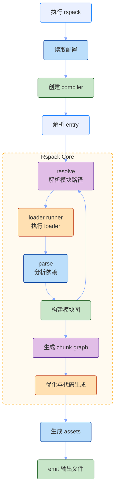
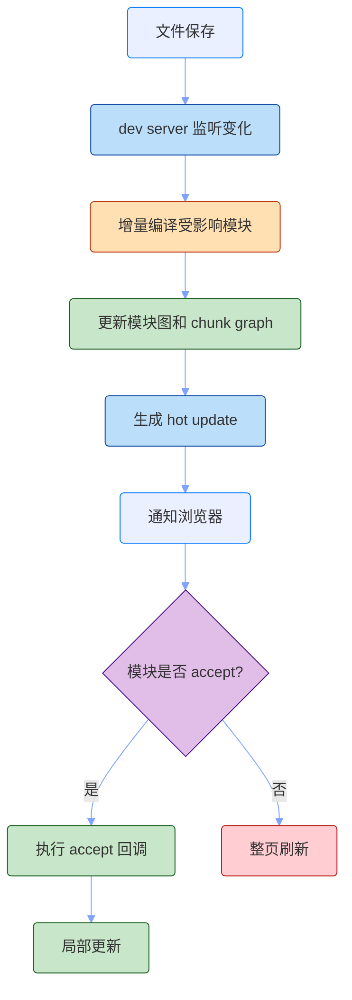
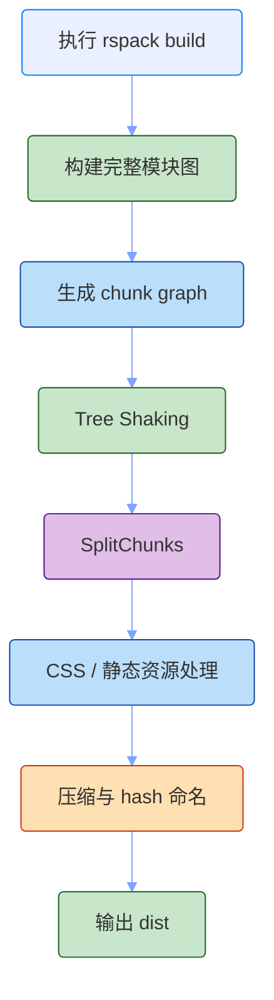

# Rspack

Rspack 可以理解成“用 Rust 重新实现、并尽量兼容 Webpack 生态的高性能打包器”。

它的目标不是像 Vite 那样重新划分开发阶段的模块加载方式，而是在 Webpack 的构建模型里，把编译、解析、优化、产物生成这些重活尽量做快，同时保留熟悉的 loader、plugin、配置和开发体验。

整体可以理解成这条主线：

`读取 Rspack 配置 -> 兼容 Webpack 配置模型 -> 构建模块图 -> 执行 loader -> Rust 内核编译优化 -> 生成 chunk -> 输出 bundle`

- `Rust 内核`：负责模块解析、依赖图、优化、产物生成等核心工作。
- `Webpack 兼容`：尽量复用 Webpack 的配置、loader 和主流插件生态。
- `loader`：沿用 Webpack loader 模型，处理源码转换。
- `plugin`：通过兼容的插件 API 介入构建生命周期。
- `dev server`：提供本地开发、HMR、静态资源服务等能力。
- `incremental`：开发阶段尽量复用上一次构建结果，减少重复工作。

我的理解是：Rspack 解决的是“我仍然需要 Webpack 的构建模型和生态，但我希望它更快”。它不是完全换一种开发范式，而是把 Webpack 这套模型换成更高性能的实现。

## 构建流程

Rspack 的整体流程和 Webpack 很接近：从入口开始构建模块图，经过 loader 和插件处理，再生成 chunk 和最终资源。

不同点在于，Rspack 的核心编译链路由 Rust 实现，并且更强调并行化和增量构建。

大致流程如下：



这条链路可以拆成几个关键步骤。

### 1. 读取配置

Rspack 的配置形态接近 Webpack。

一个基础配置大致是这样：

```js
const path = require('path')

module.exports = {
  mode: 'development',
  entry: './src/index.js',
  output: {
    path: path.resolve(__dirname, 'dist'),
    filename: 'main.js',
  },
  module: {
    rules: [
      {
        test: /\.tsx?$/,
        use: 'builtin:swc-loader',
      },
    ],
  },
}
```

从使用者角度看，很多概念仍然是熟悉的：

- `entry`：入口。
- `output`：产物输出。
- `resolve`：模块解析。
- `module.rules`：loader 规则。
- `plugins`：插件。
- `optimization`：优化策略。
- `devServer`：开发服务器。

这也是 Rspack 的迁移价值：如果一个项目已经是 Webpack 模型，迁移到 Rspack 通常比迁移到 Vite 更接近“替换构建引擎”。

### 2. 构建模块图

Rspack 仍然从入口开始构建模块图。

例如：

```js
import React from 'react'
import './style.css'
import logo from './logo.png'
```

这些依赖都会进入模块图。Rspack 会根据模块类型和规则决定如何处理：

- JS / TS / JSX / TSX：通常走内置 SWC 能力或 loader。
- CSS：可以走内置 CSS 处理，也可以配合 loader。
- 图片和字体：作为 asset module 进入产物。
- 动态导入：形成异步 chunk。

所以 Rspack 和 Vite 的开发模型不同。Rspack 仍然是“先构建模块图，再输出 bundle”；Vite dev 则尽量保持源码模块，由浏览器按 ESM 请求。

### 3. 执行 loader

Rspack 兼容 Webpack loader 体系。这一点很关键，因为大量历史项目的构建能力都沉淀在 loader 里。

例如：

```js
module.exports = {
  module: {
    rules: [
      {
        test: /\.less$/,
        use: ['style-loader', 'css-loader', 'less-loader'],
      },
    ],
  },
}
```

这个模型和 Webpack 一样，loader 从右到左执行：

```text
style-loader(css-loader(less-loader(source)))
```

Rspack 也提供一些内置能力，比如 `builtin:swc-loader`。如果项目只是做 JS/TS 转换，优先使用内置能力通常更快；如果项目依赖复杂的历史 loader，也可以继续复用。

### 4. 执行 plugin

Rspack 也提供兼容 Webpack 的插件接口，但这里要注意：loader 兼容通常更直接，plugin 兼容会更依赖具体插件使用了哪些 Webpack 内部 API。

可以这样理解：

- 常见插件和主流场景，Rspack 会尽量兼容。
- 深度依赖 Webpack 内部实现细节的插件，迁移时可能需要替换或调整。
- Rspack 自己也提供专门的内置插件和生态工具。

所以迁移时不能只看配置文件能不能跑，还要看插件是否真正覆盖原来的构建语义。

## 为什么快

Rspack 的快，主要来自几个方向。

### Rust 内核

Webpack 的核心运行在 Node.js 中。Node.js 对 I/O 和生态集成很友好，但大量 CPU 密集型编译、解析、优化工作会受到 JavaScript 单线程和运行时开销影响。

Rspack 的核心编译链路用 Rust 实现，可以更充分利用原生性能和多线程能力。

这不是简单的“语言更快”，而是构建工具里有很多适合原生实现的重活：

- 解析模块。
- 分析依赖。
- 构建图结构。
- 生成 chunk。
- 代码生成。
- 压缩和优化。

这些环节越重，Rspack 的优势越明显。

### 并行化

大型项目里，很多模块转换和分析并不是完全串行依赖。Rspack 可以在核心链路里更积极地并行处理。

简化理解：

```text
Webpack
  -> 大量逻辑运行在 JS 构建流程里
  -> 并行能力更多依赖 loader / plugin / worker 配置

Rspack
  -> 核心图构建和优化由 Rust 内核承担
  -> 更容易利用多核 CPU
```

这也是为什么 Rspack 在大项目迁移场景里经常有明显体感提升。

### 内置常见能力

Webpack 里很多能力依赖外部 loader 或 plugin 组合。Rspack 会把一些常见能力内置或做专门优化。

例如：

- JS / TS 转换。
- CSS 处理。
- asset module。
- HMR。
- splitChunks。
- minify。

内置并不只是少装几个包，更重要的是减少跨插件、跨 loader 的调度成本。

## HMR 流程

Rspack 的 HMR 模型更接近 Webpack，而不是 Vite。

文件变化后，Rspack 会重新编译受影响模块，生成热更新信息，再由浏览器端 runtime 应用更新。

大致流程如下：



所以 Rspack HMR 快，不是因为它像 Vite 一样让浏览器直接重新 import 源码 ESM 模块，而是因为它把 Webpack 式增量编译做得更快。

在 React 项目里，组件状态能不能保留，仍然取决于 React Refresh 边界；在 Vue 项目里，也取决于对应的 SFC 热更新逻辑。Rspack 提供的是更快的打包和热更新通道。

## 生产构建

生产构建时，Rspack 和 Webpack 的目标一致：输出适合线上部署的静态资源。

大致流程如下：



生产构建会关注：

- Tree Shaking。
- 代码分割。
- CSS 抽取。
- 静态资源处理。
- 压缩。
- 内容 hash。
- 长期缓存。

和 Vite 一样，Rspack 生产环境也会完整打包。区别在于 Rspack 的构建模型更接近 Webpack，而 Vite 的开发体验更依赖原生 ESM 模块服务。

## 和 Webpack 的差异

Rspack 最重要的定位，是兼容 Webpack 生态并提升性能。

| 维度 | Webpack | Rspack |
| --- | --- | --- |
| 核心实现 | JavaScript / Node.js | Rust 内核 |
| 构建模型 | 从 entry 构建模块图并输出 bundle | 同样构建模块图并输出 bundle |
| 配置 | Webpack 配置体系 | 尽量兼容 Webpack 配置 |
| Loader | Webpack loader 生态 | 兼容 Webpack loader，并提供内置 loader |
| Plugin | 插件生态最成熟 | 兼容主流插件，但深度插件需验证 |
| HMR | 基于 runtime 和 hot update chunk | 模型接近 Webpack，但增量编译更快 |
| 迁移成本 | 原生方案 | 通常低于迁移到 Vite |
| 适用场景 | 高度定制、生态最完整 | 想保留 Webpack 模型但提升性能 |

所以 Rspack 不是“另一个 Vite”。它更像 Webpack 的高性能替代实现。

如果一个项目的核心诉求是：

- 继续使用 Webpack 配置结构。
- 复用 loader 生态。
- 保留代码分割和插件体系。
- 降低迁移风险。
- 提升冷启动和 HMR 速度。

那么 Rspack 会比 Vite 更接近原系统。

## 和 Vite 的差异

Rspack 和 Vite 都追求更好的开发体验，但路线不同。

| 维度 | Vite | Rspack |
| --- | --- | --- |
| 开发模型 | 原生 ESM 模块服务 | 高性能 bundle 构建 |
| 启动方式 | 先启动 dev server，源码按需转换 | 先构建模块图，再服务 bundle |
| 依赖处理 | 依赖预构建，源码按需转换 | 依赖和源码都进入构建图 |
| HMR | 浏览器重新 import 更新模块 | 生成 hot update 并由 runtime 应用 |
| 生态定位 | 现代 ESM 项目的开发体验 | Webpack 生态的性能升级 |
| 迁移对象 | 更适合新项目或现代项目 | 更适合 Webpack 存量项目 |

可以这样概括：

`Vite 是改变开发阶段的工作模型，Rspack 是加速 Webpack 式构建模型。`

所以选择时不要只问“哪个更快”，而要问“项目更依赖哪种构建模型”。

## 常见边界

Rspack 的迁移成本相对低，但不是零成本。

### Plugin 兼容需要验证

loader 通常比较容易复用，但 plugin 可能会触碰 Webpack 内部实现细节。越是深度定制的插件，越需要单独验证。

迁移时要重点检查：

- HTML 生成。
- CSS 抽取。
- Module Federation。
- 资源复制。
- 环境变量注入。
- 自定义构建插件。
- 产物分析插件。

### 构建语义要对齐

即使配置能跑，也要确认产物语义一致：

- chunk 名称是否稳定。
- publicPath 是否一致。
- CSS 顺序是否变化。
- 动态导入路径是否一致。
- 资源 hash 是否符合缓存策略。
- sourcemap 是否满足调试要求。

构建工具迁移不能只看速度，也要看线上产物是否等价。

### 不适合只追求 ESM dev server 的项目

如果项目目标是完全拥抱浏览器原生 ESM 开发模型，减少 bundle 型开发服务，那么 Vite 更贴近这个方向。

Rspack 的优势是加速 bundle 模型，而不是抛弃 bundle 模型。

## 总结

Rspack 的核心，是用 Rust 实现一套高性能、Webpack 兼容的打包器。

它保留了 Webpack 熟悉的入口、模块图、loader、plugin、chunk、bundle 模型，同时把大量编译和优化工作放到更快的内核里执行。

所以理解 Rspack，要抓住两个关键词：

- 兼容：尽量复用 Webpack 的配置、loader 和主流插件生态。
- 加速：通过 Rust、并行化、内置能力和增量编译提升构建与 HMR 速度。

它适合那些“Webpack 太慢，但又不能轻易抛弃 Webpack 生态”的项目。对这类项目来说，Rspack 的价值不是换一套开发哲学，而是在原有工程模型上把反馈速度拉起来。
