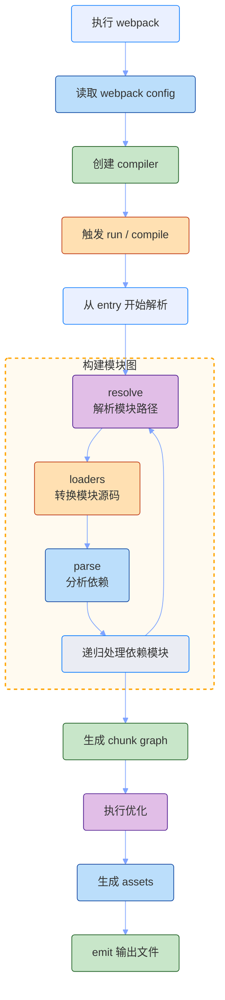
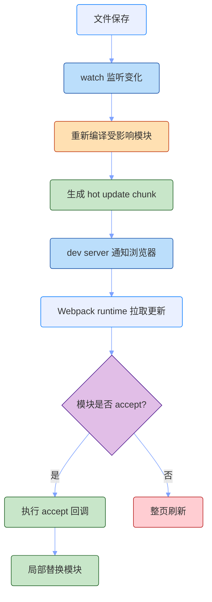
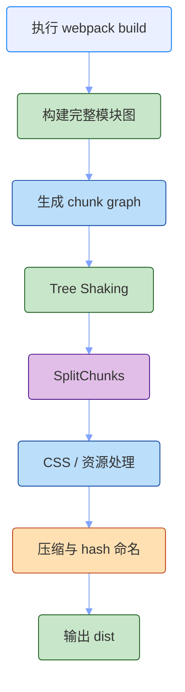

# Webpack 原理

Webpack 的核心，是把应用里的各种资源都看成模块，然后从入口开始构建依赖图，最后输出浏览器可以加载的 bundle。

它不只处理 JavaScript。CSS、图片、字体、JSON、WASM、模板文件，都可以通过 loader 和 plugin 进入同一套构建流程。

整体可以理解成这条主线：

`读取配置 -> 找到 entry -> 构建模块依赖图 -> loader 转换模块 -> plugin 参与编译 -> 生成 chunk -> 输出 bundle`

- `entry`：构建入口，Webpack 从这里开始收集依赖。
- `module`：依赖图里的单个模块，可以是 JS，也可以是 CSS、图片等资源。
- `loader`：把某类文件转换成 Webpack 能理解的模块。
- `plugin`：介入编译生命周期，扩展资源生成、优化、注入等能力。
- `chunk`：一组模块打包后的中间产物。
- `bundle`：最终写入磁盘或交给 dev server 的浏览器资源。

我的理解是：Webpack 解决的不是“怎么把 JS 合成一个文件”这么简单，而是解决“复杂前端应用里的资源、依赖、构建生命周期如何统一组织”。它的强大来自统一构建图和插件系统，复杂也来自这里。

## 构建流程

Webpack 构建的核心，是从入口出发，把所有被引用到的模块纳入一张依赖图。构建完成后，再根据入口、动态导入、分包规则，把模块图切成一个或多个 chunk，最后生成 bundle。

大致流程如下：



这条链路可以拆成几个关键步骤。

### 1. 读取配置

Webpack 的配置描述了构建从哪里开始、如何处理模块、产物输出到哪里、哪些插件参与编译。

一个最小配置大致是这样：

```js
const path = require('path')

module.exports = {
  mode: 'development',
  entry: './src/index.js',
  output: {
    path: path.resolve(__dirname, 'dist'),
    filename: 'main.js',
  },
}
```

实际项目通常还会配置：

- `resolve`：别名、扩展名、模块查找规则。
- `module.rules`：不同文件类型对应的 loader。
- `plugins`：HTML 注入、CSS 抽取、环境变量、产物分析等。
- `optimization`：代码分割、压缩、runtime 拆分、缓存策略。
- `devServer`：本地开发服务和 HMR。

Webpack 的配置能力很强，因为它几乎把整个构建过程都暴露成可配置对象。代价是概念多，项目复杂后配置也容易变厚。

### 2. 创建 compiler

配置读取完成后，Webpack 会创建 `compiler`。可以把 `compiler` 理解成一次构建任务的总控制器。

它负责：

- 保存完整配置。
- 管理构建生命周期。
- 暴露插件钩子。
- 启动 compilation。
- 控制 watch、emit、done 等流程。

插件就是通过 `compiler.hooks` 介入这些生命周期的：

```js
class ExamplePlugin {
  apply(compiler) {
    compiler.hooks.done.tap('ExamplePlugin', () => {
      console.log('build done')
    })
  }
}
```

这就是 plugin 和 loader 的第一层差异：plugin 面向构建生命周期，loader 面向单个模块源码转换。

### 3. 从 entry 构建模块图

Webpack 会从 `entry` 开始解析模块。

例如入口文件：

```js
import React from 'react'
import './style.css'
import logo from './logo.png'
```

Webpack 会把这些 import 都视为依赖：

- `react` 是一个 npm 依赖模块。
- `style.css` 是一个样式模块。
- `logo.png` 是一个资源模块。

它会根据 `resolve` 规则找到真实文件，再根据 `module.rules` 找到对应 loader，然后把转换后的结果解析成模块。

这个过程会递归进行。入口依赖 A，A 依赖 B，B 又依赖 C，最终都会被纳入模块图。

### 4. loader 转换模块

loader 解决的是“某个文件如何变成模块”。

例如 CSS 本身不是浏览器能直接通过 JS bundle 执行的模块，需要 loader 处理：

```js
module.exports = {
  module: {
    rules: [
      {
        test: /\.css$/,
        use: ['style-loader', 'css-loader'],
      },
    ],
  },
}
```

loader 的执行顺序是从右到左：

```text
style-loader(css-loader(source))
```

所以这段配置大致表示：

- `css-loader`：解析 CSS 里的 `@import`、`url()`，把 CSS 转成 JS 模块。
- `style-loader`：把 CSS 通过 JS 注入到页面的 `<style>` 标签里。

再比如 TypeScript：

```js
module.exports = {
  module: {
    rules: [
      {
        test: /\.tsx?$/,
        use: 'swc-loader',
        exclude: /node_modules/,
      },
    ],
  },
}
```

这里 loader 只关心匹配到的模块怎么转换。它不负责全局优化，也不负责产物输出。

### 5. plugin 介入生命周期

plugin 解决的是“构建流程如何扩展”。

例如：

- `HtmlWebpackPlugin`：生成 HTML，并自动注入 bundle。
- `MiniCssExtractPlugin`：把 CSS 从 JS bundle 中抽离成单独 CSS 文件。
- `DefinePlugin`：在编译阶段替换常量。
- `HotModuleReplacementPlugin`：启用 HMR 运行时能力。

plugin 可以参与多个阶段：

```text
environment
  -> compile
  -> compilation
  -> make
  -> seal
  -> processAssets
  -> emit
  -> done
```

所以 plugin 的能力比 loader 更全局。loader 像“处理单个文件的转换函数”，plugin 像“插入构建流水线的扩展点”。

## Chunk 和 Bundle

Webpack 构建出来的不是简单的“一个模块对应一个文件”。它会把模块组织成 chunk，再把 chunk 渲染成最终文件。

可以这样理解：

```text
module
  -> 源码中的一个模块

chunk
  -> 一组 module 的集合

bundle / asset
  -> chunk 最终输出到磁盘的文件
```

例如：

```js
import('./settings')
```

动态导入会形成异步 chunk。最终产物可能是：

```text
main.[hash].js
settings.[hash].js
```

浏览器先加载入口 bundle，等执行到动态导入时，再加载异步 chunk。

这就是代码分割的基础：Webpack 不只是把所有代码合成一个文件，也可以根据入口、动态导入和 `splitChunks` 策略拆成多个文件。

## HMR 流程

HMR 解决的是开发阶段文件变化后的反馈速度问题。Webpack 的 HMR 建立在 bundle 和 runtime 之上。

大致流程如下：



HMR 的核心是模块自己声明能否接受热更新：

```js
if (module.hot) {
  module.hot.accept('./foo', () => {
    // 重新读取 foo，并更新当前页面
  })
}
```

如果模块链路上没有找到能处理更新的边界，Webpack 就只能整页刷新。

在 React、Vue 等项目中，业务代码通常不会手写这些回调，而是由框架 loader 或插件接入。例如 React Fast Refresh 会处理组件级刷新，Vue loader 会处理 SFC 的模板、脚本、样式更新。

## 生产构建

生产构建的目标不是反馈速度，而是产物质量。

Webpack 在生产模式下会更关注：

- Tree Shaking。
- 代码压缩。
- CSS 抽取。
- 资源 hash。
- runtime 拆分。
- splitChunks。
- 长期缓存。

大致流程如下：



生产构建里最容易影响最终体验的是缓存策略。常见做法是：

```js
module.exports = {
  output: {
    filename: '[name].[contenthash].js',
    chunkFilename: '[name].[contenthash].js',
  },
  optimization: {
    runtimeChunk: 'single',
    splitChunks: {
      chunks: 'all',
    },
  },
}
```

这样业务代码、第三方依赖、运行时代码可以被拆开，只有真正变化的文件才会改变 hash。

## 为什么复杂

Webpack 复杂，主要不是因为 API 难记，而是因为它承担的职责太多。

### 统一处理所有资源

Webpack 把各种资源都纳入模块图。这带来很强的表达能力：

- JS import CSS。
- CSS 里引用图片。
- 组件里引用字体。
- 动态导入页面模块。
- 插件生成 HTML、manifest、service worker。

但这也意味着资源之间的关系都要被构建系统理解。项目越复杂，配置和插件组合就越重要。

### 构建生命周期很长

Webpack 给插件暴露了大量钩子。好处是几乎什么都能扩展，坏处是构建行为可能被多个插件共同影响。

一个问题可能来自：

- resolve 配置。
- loader 顺序。
- plugin 生命周期。
- cache 命中。
- optimization 分包。
- devServer 行为。

所以排查 Webpack 问题时，不能只看最终 bundle，还要理解中间构建过程。

### 开发和生产目标不同

开发环境追求快：

```text
source map
  -> HMR
  -> 增量编译
  -> 缓存
```

生产环境追求稳和小：

```text
tree shaking
  -> minify
  -> split chunks
  -> contenthash
```

同一个配置文件里要兼顾两套目标，复杂度自然会上升。

## 和 Vite 的差异

Webpack 和 Vite 最大的差异，在开发阶段的模块加载方式。

| 维度       | Webpack                          | Vite                           |
| ---------- | -------------------------------- | ------------------------------ |
| 开发模型   | 先构建 bundle，再服务 bundle     | 先启动模块服务，再按需转换源码 |
| 浏览器加载 | 加载 Webpack runtime 和 bundle   | 按原生 ESM 请求源码模块        |
| 源码处理   | 通常启动时进入构建图             | 请求到时才转换                 |
| HMR        | 围绕 hot update chunk 和 runtime | 围绕 ESM 模块和 HMR 边界       |
| 配置能力   | 极强，适合复杂历史项目           | 默认约定更强，新项目更轻       |
| 生产构建   | 完整打包                         | 完整打包                       |

所以 Webpack 不是“过时的 Vite”。它更像一个通用构建平台，适合复杂资源处理、深度定制、历史项目和成熟插件生态。Vite 更像针对现代浏览器和 ESM 生态重新设计的开发体验方案。

## 常见边界

Webpack 的优势很明显，但也有边界。

### 冷启动可能变慢

Webpack 需要从入口构建依赖图。项目越大、loader 越多、插件越复杂，冷启动越容易变慢。

缓存可以缓解这个问题，但不能完全改变“先构建再服务”的基本模型。

### HMR 成本受构建图影响

Webpack HMR 是增量编译，不是简单替换源码文件。文件变化后，仍然要重新编译受影响模块并生成 hot update chunk。

如果模块链路复杂，或者 loader 本身很重，热更新也可能变慢。

### 配置自由度带来维护成本

Webpack 很灵活，但灵活意味着每个项目都可能长出自己的配置风格。长期维护时，需要团队理解 loader、plugin、optimization、devServer 之间的关系。

## 总结

Webpack 的核心，是从入口构建完整模块图，再把模块图转换成浏览器可加载的 bundle。

它的价值在于统一：统一处理 JS、CSS、图片等资源，统一管理构建生命周期，统一通过 loader 和 plugin 扩展能力。

它的成本也来自统一：开发阶段需要先构建应用级依赖图，配置项多，插件链长，大项目里冷启动和 HMR 容易变重。

所以理解 Webpack，不应该只把它看成“打包工具”，而应该把它看成一个可编程的构建平台。掌握它的关键，是理解模块图、loader、plugin、chunk 和 runtime 之间的关系。
