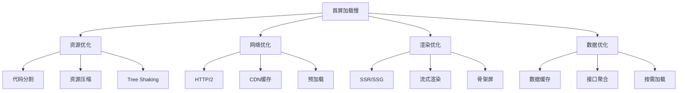

# 性能指标采集

通过浏览器原生 API 采集页面性能数据，是白屏问题排查和体验优化的基础。本文介绍 FP、FCP、LCP、INP、CLS、TTFB、DNS、TCP 等核心指标的采集方式和代码实现。

## 性能指标体系

| 指标                            | 说明           | 采集方式             | 阈值参考      |
| ------------------------------- | -------------- | -------------------- | ------------- |
| FP (First Paint)                | 首次渲染时间   | Performance Observer | >3s 异常      |
| FCP (First Contentful Paint)    | 首次内容绘制   | Performance Observer | >4s 需关注    |
| LCP (Largest Contentful Paint)  | 最大内容绘制   | Performance Observer | >4.0s 需优化  |
| INP (Interaction to Next Paint) | 交互响应性     | Performance Observer | >200ms 需优化 |
| CLS (Cumulative Layout Shift)   | 累计布局偏移   | Performance Observer | <0.1 为佳     |
| TTFB (Time To First Byte)       | 首字节到达时间 | Navigation Timing    | >800ms 需关注 |
| DNS Lookup                      | DNS 解析耗时   | Navigation Timing    | >300ms 需关注 |
| TCP 连接耗时                    | TCP 建立耗时   | Navigation Timing    | >500ms 需关注 |

> **关于 FP**：Google 废弃 FP 作为 Core Web Vitals 考核指标，是因为它仅反映"有像素变化"而非"有内容"，过于粗糙。LCP + CLS 的组合能更好地替代它的作用。FP 对白屏排查仍有参考价值——若 FP 有数据但 FCP 为空，说明渲染了但无实际内容。<br />
> **关于 INP**：2024 年正式替代 FID，衡量所有用户交互（点击、键盘、触控）到下一次渲染的完整耗时，比仅衡量首次交互更全面。

### 实时数据

<script setup>
import PerformanceDemo from '../../components/PerformanceDemo/PerformanceDemo.vue'
</script>

<PerformanceDemo />

## 采集方案

所有指标通过三大 API 获取：

- **Performance Observer** — 渲染体验类（FP、FCP、LCP、INP、CLS）
- **Navigation Timing** — 页面加载阶段类（TTFB、DNS、TCP）
- **Resource Timing** — 单个资源维度（分析资源层面的性能损耗）
- **performance.mark / measure** — 业务自定义打点

### Performance Observer API

统一监听 FP / FCP / LCP / INP / CLS 五项渲染体验指标。`buffered: true` 必须开启——不加的话，注册 Observer 之前已发生的 paint / layout-shift 事件会被遗漏，导致 CLS 始终为 0。

```js
const po = new PerformanceObserver((list) => {
  for (const entry of list.getEntries()) {
    // FP / FCP
    if (entry.entryType === 'paint') {
      if (entry.name === 'first-paint') perfData.fp = entry.startTime
      if (entry.name === 'first-contentful-paint') perfData.fcp = entry.startTime
    }
    // LCP：取最后一个条目
    if (entry.entryType === 'largest-contentful-paint') {
      perfData.lcp = entry.startTime
    }
    // INP：取所有交互中耗时最长的
    if (entry.entryType === 'event') {
      const duration = entry.processingStart + entry.duration - entry.startTime
      perfData.inp = Math.max(perfData.inp, duration)
    }
    // CLS：累加所有非用户输入导致的偏移
    if (entry.entryType === 'layout-shift' && !entry.hadRecentInput) {
      perfData.cls += entry.value
    }
  }
})

po.observe({ entryTypes: ['paint', 'largest-contentful-paint', 'event', 'layout-shift'], buffered: true })
```

**INP 计算**：`entry.processingStart + entry.duration - entry.startTime`，即从用户触发事件到浏览器完成渲染的完整耗时。

### Navigation Timing API

页面级别的加载阶段耗时，通过 `performance.getEntriesByType('navigation')[0]` 一次性获取。

```js
const nav = performance.getEntriesByType('navigation')[0]

const ttfb = nav.responseStart - nav.fetchStart // 首字节到达
const dns = nav.domainLookupEnd - nav.domainLookupStart // DNS 解析
const tcp = nav.connectEnd - nav.connectStart // TCP 连接
const domParse = nav.domContentLoadedEventEnd - nav.domContentLoadedEventStart // DOM 解析耗时
const load = nav.loadEventEnd - nav.loadEventStart // load 事件耗时
const total = nav.loadEventEnd - nav.navigationStart // 页面完全加载
```

### Resource Timing API

针对每个静态资源的耗时分析，用于判断哪些资源拖慢了整体加载。

```js
const resources = performance.getEntriesByType('resource')

resources.forEach((r) => {
  console.log({
    name: r.name, // 资源 URL
    total: r.duration, // 资源总耗时
    transferSize: r.transferSize, // 0 = 走缓存（memory / disk）
    encodedBodySize: r.encodedBodySize, // 编码后大小
    decodedBodySize: r.decodedBodySize, // 解码后大小
  })
})
```

> **前置条件**：Resource Timing API 只能在安全上下文（HTTPS）中获取数据，非 HTTPS 环境下返回空数组。

### 自定义性能打点

业务特有的耗时，如接口请求、复杂计算等，通过 `performance.mark` 手动标记起止点。

```js
performance.mark('action_start')
// ... 业务逻辑
performance.mark('action_end')
performance.measure('action', 'action_start', 'action_end')

const [m] = performance.getEntriesByName('action')
console.log(m.duration)
```

## 指标阈值建议

| 指标 | 优秀   | 需优化    | 差     |
| ---- | ------ | --------- | ------ |
| LCP  | <2.5s  | 2.5-4.0s  | >4.0s  |
| INP  | <100ms | 100-200ms | >200ms |
| CLS  | <0.1   | 0.1-0.25  | >0.25  |
| TTFB | <200ms | 200-800ms | >800ms |

> **阈值说明**：以下阈值基于 Google 官方推荐，实际应用时应结合业务场景、目标用户群体（如不同地区网络环境差异）调整。

## 指标数据上报

使用 `navigator.sendBeacon` 或 `fetch` 配合 `keepalive` 确保页面关闭后仍能完成上报。

```js
const report = (data) => {
  const payload = JSON.stringify(data)
  if (navigator.sendBeacon) {
    navigator.sendBeacon('/analytics', payload)
  } else {
    fetch('/analytics', {
      method: 'POST',
      body: payload,
      keepalive: true,
      headers: { 'Content-Type': 'application/json' },
    })
  }
}
```

## 白屏时间长 / 首屏渲染慢

首屏优化四大方向：



### 排查路径

```
用户反馈白屏或首屏渲染慢
├── FP 无数据
│   ├── JS 阻塞 / DOMContentLoaded 延迟
│   │   ├── 主线程长任务 > 50ms → 优化算法、Web Worker、防抖节流、虚拟列表
│   │   └── 同步 JS 阻塞 → 检查 async/defer、关键 CSS 内联、预加载
│   └── 网络请求卡住 → 检查 fetch/xhr 长时间 pending
├── FP 有数据但 FCP 无
│   ├── 资源加载失败 → 检查图片/CDN/静态资源是否 4xx/5xx/403/跨域错误
│   └── 接口超时 → 检查首屏 API 请求是否超时或阻塞
├── FCP > 4s
│   ├── JS bundle / 资源过大 → Code Splitting、Tree Shaking、图片懒加载、字体子集化
│   ├── 资源未压缩 → 检查 gzip/brotli 压缩
│   └── 渲染阻塞 → 非关键 CSS 异步加载、脚本 async/defer
├── LCP 问题
│   ├── LCP 无数据 → 主内容元素缺失，可能是 SSR/CSR 问题
│   ├── LCP 极长（>4s）→ 图片优化、CDN 失效、关键接口阻塞
│   └── LCP 为非目标元素 → 检查 LCP 元素是否应为产品图而非骨架屏
└── TTFB > 800ms → HTTP/2、CDN 加速、SSR/边缘计算、DNS/TCP 配置
```

### 常见原因及解决办法

| 原因                   | 表现                                          | 解决办法                                                                    |
| ---------------------- | --------------------------------------------- | --------------------------------------------------------------------------- |
| **网络延迟 / TTFB**    | TTFB > 1s，Waterfall 图阻塞高                 | HTTP/2；Brotli/Gzip 压缩；CDN 加速；SSR/边缘计算；对比优化前后 Waterfall 图 |
| **首屏接口阻塞渲染**   | FCP 有数据但页面空白，直到接口返回才展示      | 接口并行请求；数据内联 HTML 或使用 skeleton                                 |
| **渲染阻塞资源**       | FP 无/极晚，DOMContentLoaded 延迟，LCP 极长   | JS 改 async/defer；关键 CSS 内联；非关键 CSS/JS 延迟加载；预加载关键资源    |
| **资源过大**           | 单个 JS/CSS > 500KB，打包体积大               | Code Splitting；Tree Shaking；图片懒加载；字体子集化；Bundle Analyzer 分析  |
| **JS 执行慢 / 长任务** | 主线程长任务 > 50ms，火焰图卡顿               | 优化算法复杂度；Web Worker；防抖节流；虚拟列表；Performance 火焰图定位      |
| **资源加载失败**       | 控制台有 4xx/5xx/403/504/跨域错误，LCP 无数据 | 检查资源路径、CDN 配置、跨域策略；添加兜底逻辑                              |
| **内存泄漏**           | 内存持续增长，定时器/监听器未清理             | 移除事件监听器；清理定时器；弱引用；Memory 面板堆快照对比                   |

### 关键资源配置示例

```html
<!-- 预加载关键资源（需加 crossorigin 否则 CORS 预检失败） -->
<link rel="preload" href="/main.js" as="script" crossorigin />
<link rel="preload" href="/hero.webp" as="image" crossorigin />

<!-- 关键 CSS 内联 -->
<style>
  /* 关键渲染路径 CSS */
</style>

<!-- 非关键资源异步加载 -->
<link rel="preload" href="/non-critical.css" as="style" onload="this.onload=null;this.rel='stylesheet'" />

<!-- 第三方脚本延后 -->
<script src="https://analytics.com/script.js" async></script>

<!-- 字体预加载 + font-display -->
<link rel="preload" href="/fonts/main.woff2" as="font" type="font/woff2" crossorigin />
<style>
  @font-face {
    font-family: 'Main';
    src: url('/fonts/main.woff2') format('woff2');
    font-display: swap;
  }
</style>
```
